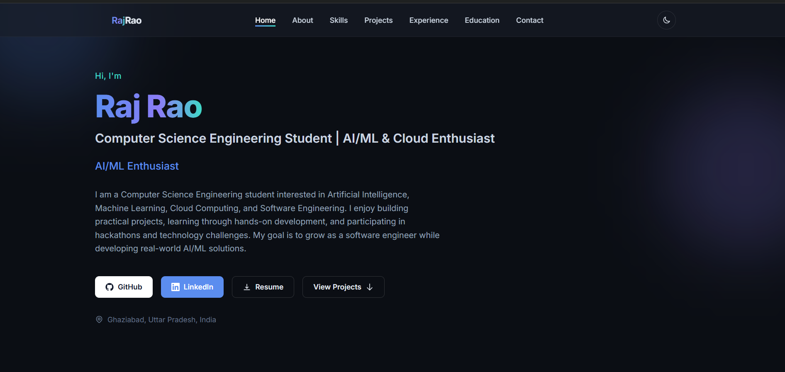
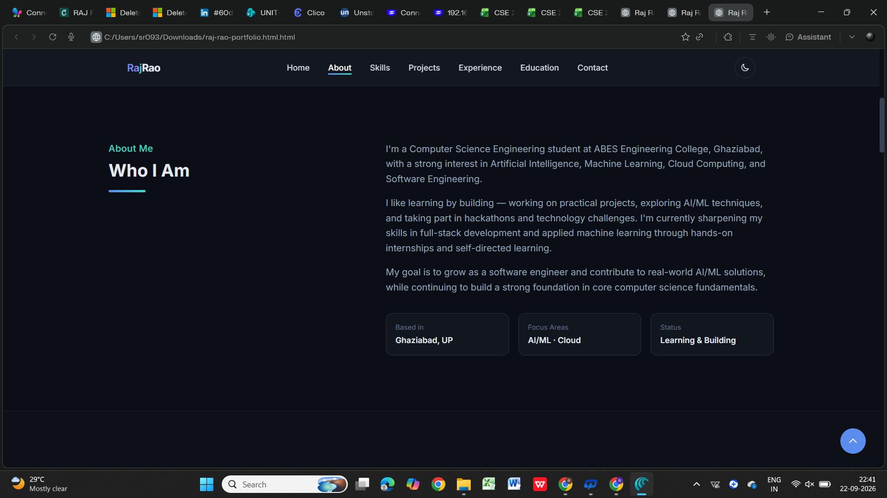
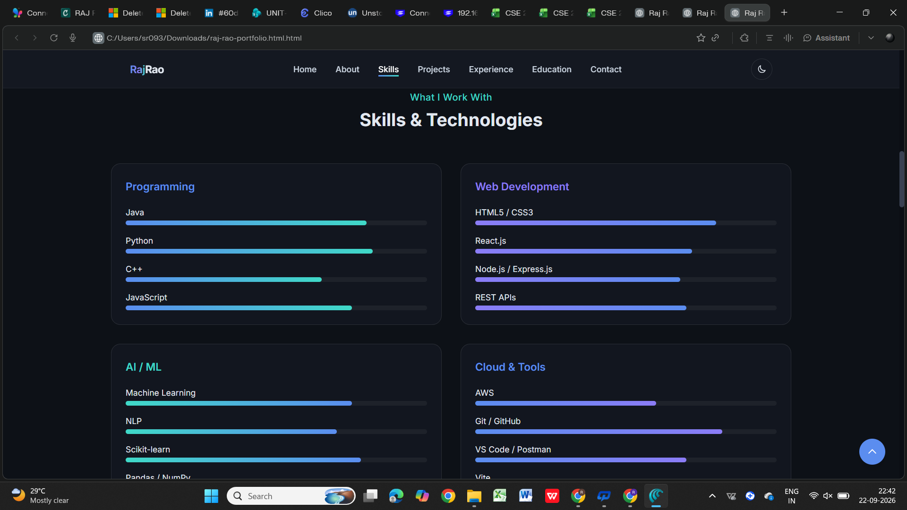
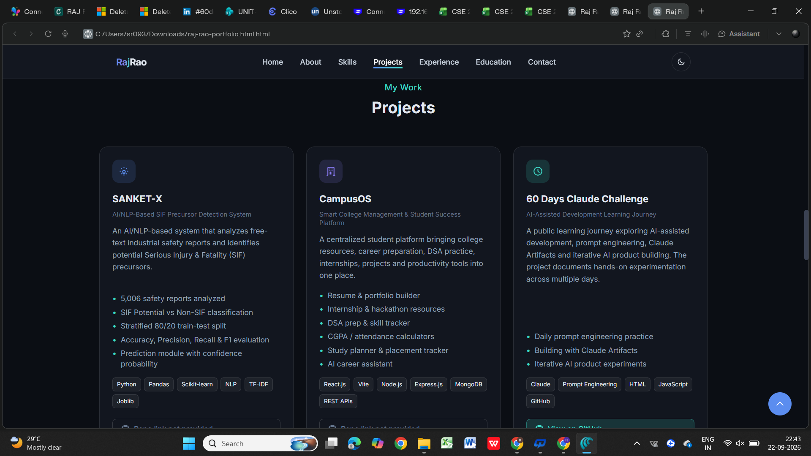
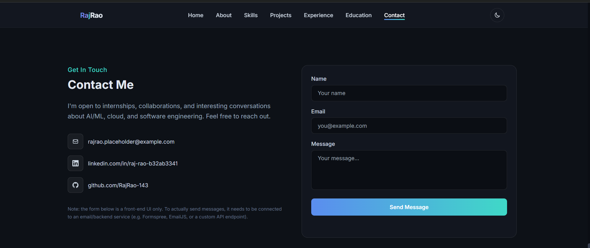

# Day 10 – Personal Portfolio Website with Claude

## 🎯 Objective

The goal of Day 10 was to use Claude to build a complete personal portfolio website from my profile information, skills, projects, education, and experience.

The focus was on giving Claude clear context, requirements, design preferences, and technical constraints to generate a functional portfolio website.

---

## 🛠️ What I Built

I created a modern, responsive personal portfolio website for showcasing my:

- Personal introduction
- Technical skills
- Projects
- Internship experience
- Certifications
- Education
- Contact information
- GitHub and LinkedIn profiles

The website was generated as a **single HTML file** using Claude.

---

## 💻 Technologies Used

- HTML5
- Tailwind CSS
- JavaScript
- Claude
- GitHub

---

## ✨ Main Features

### 🏠 Hero Section
- Personal introduction
- Professional title
- Typing animation
- Social media links
- Resume access

### 👨‍💻 About Me
- Computer Science Engineering background
- Interests in AI/ML, Cloud Computing and Software Engineering
- Career goals and learning interests

### 🧰 Skills
- Programming languages
- Web development technologies
- AI/ML technologies
- Databases
- Cloud and developer tools

### 🚀 Projects
The portfolio showcases projects including:

- **SANKET-X** – AI/NLP-based SIF Precursor Detection System
- **CampusOS** – Smart College Management & Student Success Platform
- **60 Days Claude Challenge**

### 🏆 Experience & Certifications
- Machine Learning & Applied AI Internship – IBM SkillsBuild / BharatCares
- AWS Cloud Foundation Certificate
- 60 Days Claude Challenge

### 🎓 Education
- B.Tech – Computer Science & Engineering
- ABES Engineering College, Ghaziabad
- AKTU

### 📩 Contact
- Email
- LinkedIn
- GitHub
- Contact form

---

## 🎨 Design Features

- Modern premium UI
- Dark/Light mode
- Responsive design
- Smooth scrolling
- Animated sections
- Active navigation highlighting
- Mobile-friendly layout
- Clean typography
- Blue/Cyan/Violet accent theme

---

## 📸 Screenshots

### 🏠 Home



### 👨‍💻 About



### 🧰 Skills



### 🚀 Projects



### 📩 Contact



---

## 📚 What I Learned

### 1. Context Matters

Providing detailed personal information helped Claude generate content that was more relevant to my profile.

### 2. Clear Requirements Improve Output

Instead of simply asking AI to "build a portfolio", I provided specific requirements for:

- Sections
- Design
- Technologies
- Responsiveness
- Animations
- Navigation
- SEO

This resulted in a more structured application.

### 3. AI-Assisted Web Development

Claude can help convert structured requirements into a functional frontend application quickly.

### 4. Personal Branding

A portfolio is not only a collection of projects. It also communicates skills, interests, experience, and career direction.

### 5. Testing Is Important

After generating the HTML file, I opened it in the browser and tested the website sections and interactions.

---

## 🔄 Development Workflow

The overall workflow was:

1. Read the Day 10 resources.
2. Set Claude's effort level to Low.
3. Started a new Claude conversation.
4. Added my personal information and technical profile.
5. Provided portfolio requirements.
6. Generated the complete HTML portfolio.
7. Downloaded the generated HTML file.
8. Opened it in the browser.
9. Tested the portfolio.
10. Captured screenshots.
11. Added the files to GitHub.

---

## 📂 Files

```text
Day10/
├── day10.md
├── raj-rao-portfolio.html
├── day10-home.png
├── day10-about.png
├── day10-skills.png
├── day10-projects.png
└── day10-contact.png
