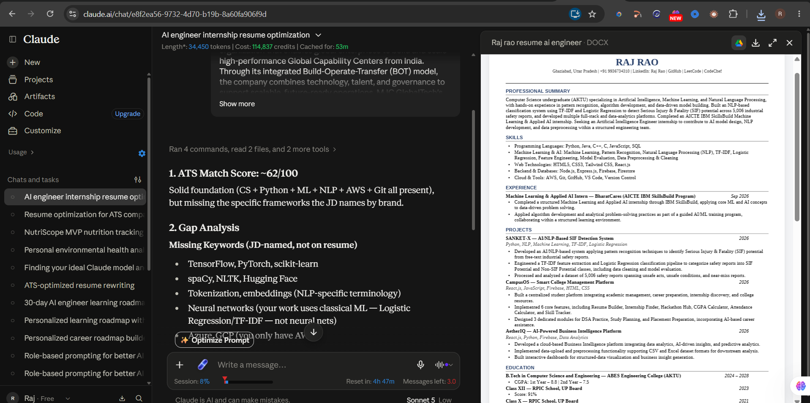
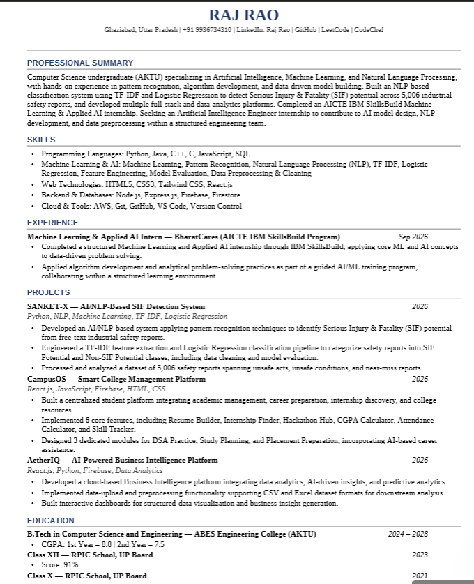

# Day 11 — ATS Resume Optimizer & Resume Generator

## Objective

Optimize my resume for a target Artificial Intelligence Engineer internship using Claude while maintaining 100% factual accuracy.

## Target Role

Artificial Intelligence Engineer Intern

## Target Company

MJC GlobalTech

## What I Did

- Uploaded my existing resume to Claude.
- Used the target Artificial Intelligence Engineer internship Job Description.
- Used the official ATS Resume Optimizer prompt.
- Generated an ATS Match Score and Gap Analysis.
- Identified missing keywords, skills, and improvement opportunities.
- Generated an ATS-optimized resume.
- Reviewed the generated resume to ensure that no unsupported projects, skills, or experience were added.

## ATS Analysis

Claude initially generated an estimated ATS Match Score of 62/100.

The main gaps identified included specific AI/ML frameworks and NLP tools mentioned in the target JD that were not present in my existing resume.

The score is an AI-generated assessment by Claude and is not an official ATS score.

## Resume Optimization

The optimized resume was revised to improve:

- AI/ML and NLP keyword alignment
- Professional summary
- Skills organization
- Project descriptions
- ATS-friendly structure
- Relevance to the target AI Engineer internship

## Screenshots

### ATS Analysis

### Optimized Resume

## Important Learning

ATS optimization should improve keyword alignment and clarity without inventing skills, projects, experience, certifications, or achievements.

## Tools Used

- Claude
- GitHub
- Microsoft Word / DOCX

## Key Takeaway

A strong ATS resume is not about adding every keyword from a Job Description. It should clearly connect genuine skills and experience with the requirements of the target role while remaining factually accurate.
