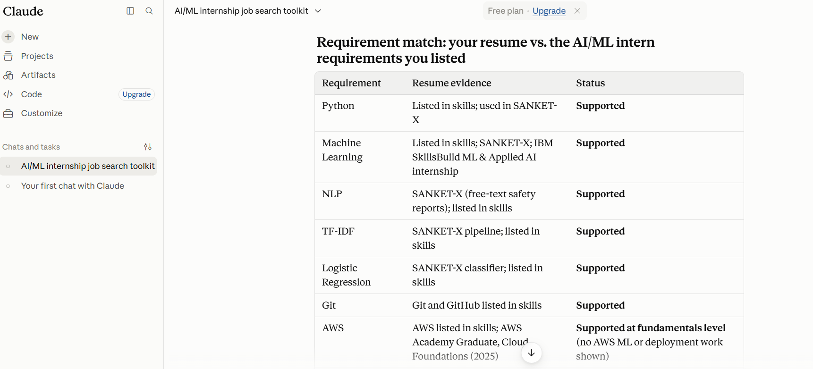
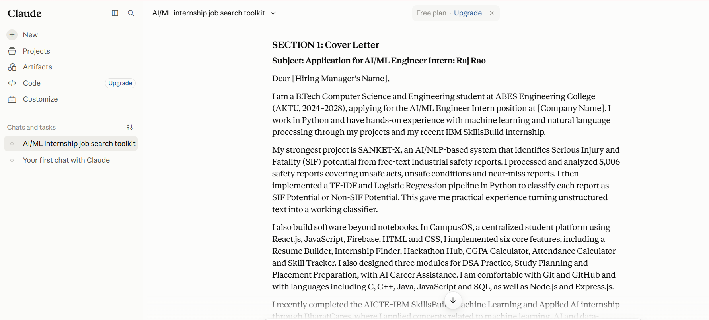
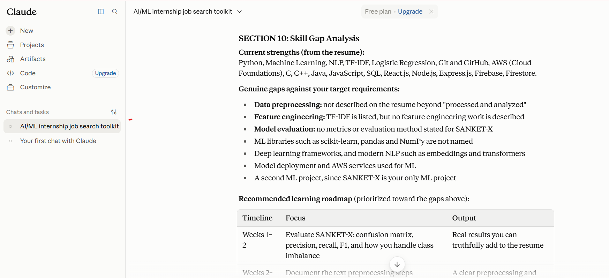
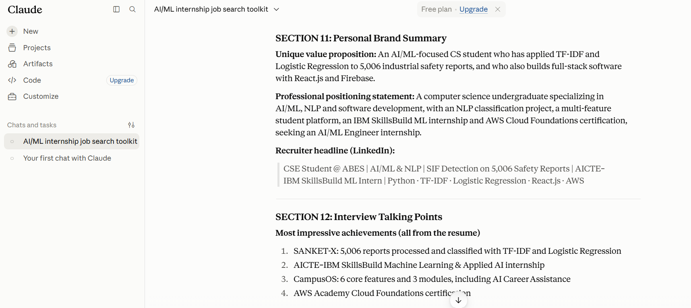

# Day 12 — Job Search & Personal Branding Toolkit

## Objective

Use Claude to create a personalized job search and personal branding toolkit for AI/ML internship applications.

## Target Role

**Artificial Intelligence / Machine Learning Engineer Intern**

## What I Did

- Used my latest resume as the primary source of information.
- Set Claude's effort level to Low.
- Defined my target role as an AI/ML Engineer Intern.
- Asked Claude to analyze my profile against AI/ML internship requirements.
- Generated a complete job search and personal branding toolkit.
- Reviewed the generated content for factual accuracy.
- Removed unsupported project claims such as AetherIQ.
- Identified genuine skill gaps instead of claiming skills that were not demonstrated in my resume.
- Created recruiter-ready communication templates and interview talking points.

## Requirement Match

Claude compared my profile against the target AI/ML internship requirements.

### Strong Matches

- Python
- Machine Learning
- Natural Language Processing (NLP)
- TF-IDF
- Logistic Regression
- Git and GitHub
- AWS fundamentals
- Software development

### Partial / Missing Areas

- Data preprocessing was not explicitly described in detail.
- Feature engineering was not explicitly described.
- Model evaluation metrics were not stated.
- Advanced ML libraries and deep learning frameworks were not prominently demonstrated.
- ML model deployment and MLOps experience was not shown.

## Generated Toolkit

Claude generated:

1. ATS-friendly cover letter
2. Recruiter outreach email
3. Hiring manager email
4. LinkedIn connection request
5. Referral request message
6. Follow-up email
7. 30-second professional introduction
8. Target job titles
9. Key recruiter strengths
10. Skill gap analysis and learning roadmap
11. Personal brand summary
12. Interview talking points

## Key Profile Highlights

### SANKET-X

An AI/NLP-based SIF detection system using:

- Python
- NLP
- TF-IDF
- Logistic Regression

The project processed and analyzed **5,006 industrial safety reports** and classified them into SIF Potential and Non-SIF Potential.

### CampusOS

A student-focused platform built using:

- React.js
- JavaScript
- Firebase
- HTML
- CSS

The platform includes multiple academic, career and student-support features.

### Experience & Certifications

- AICTE–IBM SkillsBuild Machine Learning & Applied AI Internship through BharatCares
- AWS Academy Graduate — Cloud Foundations

## Skill Gap Learning Roadmap

The generated roadmap highlighted the following areas for further learning:

- Model evaluation using confusion matrix, precision, recall and F1-score
- Data preprocessing and text cleaning
- Feature engineering
- pandas, NumPy and scikit-learn
- Model comparison
- ML model deployment
- AWS for ML applications
- Deep learning fundamentals
- Embeddings and transformer-based NLP

## Personal Branding

Claude generated a recruiter-focused positioning based on my AI/ML, NLP and software development experience.

### Suggested LinkedIn Headline

> CSE Student @ ABES | AI/ML & NLP | SIF Detection on 5,006 Safety Reports | AICTE–IBM SkillsBuild ML Intern | Python · TF-IDF · Logistic Regression · React.js · AWS

## Important Learning

The main learning from Day 12 was that job-search personalization should be based on **verified skills and real project experience**.

A job-search toolkit should:

- Match genuine skills with job requirements.
- Avoid unsupported claims.
- Highlight measurable project scope where available.
- Identify skill gaps honestly.
- Create consistent messaging across resumes, emails, LinkedIn and interviews.

## Tools Used

- Claude
- GitHub
- Resume
- Job-search and personal-branding prompts

## Screenshots

### 1. Requirement Match

### 2. Cover Letter & Emails

### 3. Skill Gap Analysis & Roadmap

### 4. Personal Brand & Interview Talking Points

## Key Takeaway

Day 12 showed me how Claude can be used as a structured job-search and personal-branding assistant, from requirement matching and skill-gap analysis to recruiter communication, personal positioning and interview preparation.

The most important part is keeping the generated content **personalized, ATS-friendly and factually accurate**.
