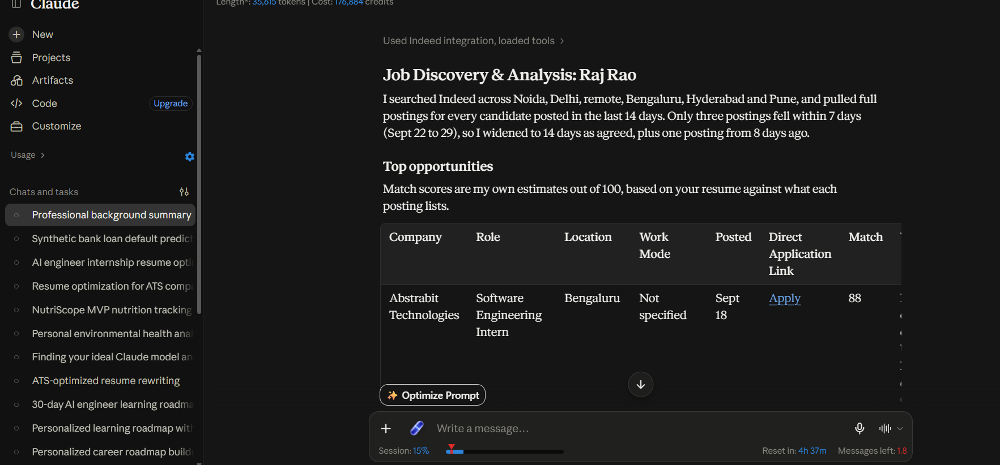
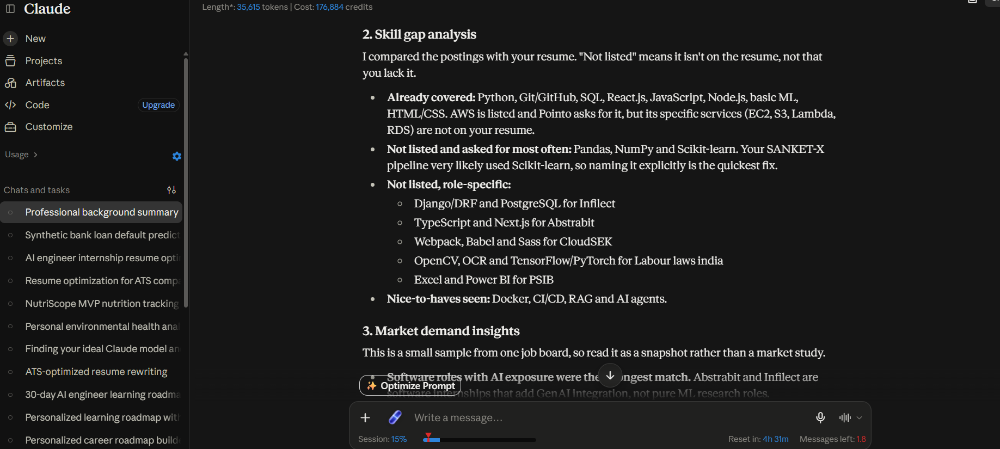

# Day 13 — Job Discovery & Analysis with Claude + Indeed

## Objective

Use Claude's Indeed integration to discover relevant internship opportunities based on my professional profile and predefined job-search criteria.

## What I Did

- Connected the Indeed integration with Claude.
- Created my professional profile using my resume.
- Defined target job titles, locations, company types, experience level and recency requirements.
- Used Claude with the Indeed integration to discover matching job opportunities.
- Reviewed job requirements, eligibility, compensation and match estimates.
- Analyzed common skills and identified gaps between my current profile and available opportunities.
- Reviewed market demand insights and interview-improvement recommendations.

## Target Roles

- AI/ML Engineer Intern
- Machine Learning Intern
- NLP Intern
- Applied AI Intern
- AI Software Engineer Intern
- Software Engineer Intern
- Data Science Intern

## Search Criteria

**Preferred Locations**
- Delhi NCR
- Noida
- Ghaziabad
- Bengaluru
- Hyderabad
- Pune
- Remote
- Hybrid

**Experience Level**
- Student/fresher-friendly internships
- Trainee and entry-level opportunities
- Current B.Tech students

**Preferred Company Types**
- Product-based technology companies
- AI/ML-focused companies
- Software companies
- Startups
- Established technology companies

**Job Recency**
- First preference: within 7 days
- Expanded to 14 days when insufficient results were available

## Opportunities Discovered

| Company | Role | Location | Posted | Match |
|---|---|---|---|---:|
| Abstrabit Technologies | Software Engineering Intern | Bengaluru | Sept 18 | 88 |
| Professional School of Indian Banking | Python Automation & Data Science Intern | Gurugram | Sept 23 | 80 |
| Infilect | Full Stack Development Intern | Bengaluru | Sept 24 | 78 |
| Labour laws india | AI/ML Intern | Delhi | Sept 21 | 76 |
| CloudSEK | SDE Intern – Frontend | Bengaluru | Sept 18 | 72 |
| Pointo | Software Development Engineer – Intern | Bengaluru | Sept 25 | 55 |

> Match scores are Claude's estimates based on my profile and the requirements in each posting. They are not official Indeed scores.

## Compensation Found

- Professional School of Indian Banking: ₹12,000–₹15,000/month
- Labour laws india: ₹4,999–₹5,000/month
- Other shortlisted postings: Not specified

## Commonly Required Skills

- Python
- Git/GitHub
- SQL
- REST APIs
- React.js / JavaScript
- Machine Learning
- Pandas
- NumPy
- Scikit-learn
- GenAI / LLM exposure

## Skill Gap Analysis

### Already Covered

- Python
- Java
- C++
- JavaScript
- SQL
- React.js
- Node.js
- Machine Learning
- NLP
- Git/GitHub
- HTML/CSS
- AWS fundamentals

### Skills to Strengthen or Make More Explicit

- Pandas
- NumPy
- Scikit-learn
- Django/DRF
- PostgreSQL
- TypeScript
- Next.js
- OpenCV
- OCR
- TensorFlow/PyTorch
- Docker
- CI/CD
- RAG
- AI agents

Some of these are role-specific rather than requirements across all opportunities.

## Market Demand Insights

- Software engineering internships with AI/GenAI exposure appeared in the search.
- Recent AI/ML internships included Python, data work, computer vision, OCR and GenAI.
- No recent NLP-focused internship appeared in this particular search.
- Many postings did not disclose compensation.
- Job-posting quality and titles can vary, so eligibility and requirements should be checked before applying.

## Key Learnings

1. Defining job-search criteria before searching makes the search more focused.
2. Matching projects against real job requirements helps identify relevant opportunities.
3. Skills such as Pandas, NumPy and Scikit-learn appeared frequently in the analyzed postings.
4. Practical projects can provide evidence of development experience.
5. Eligibility, graduation-year requirements and experience requirements should be checked before applying.
6. AI-generated match scores should be treated as estimates, not official hiring assessments.

## Claude + Indeed Workflow

**Resume → Professional Profile → Job Search Criteria → Indeed Search → Job Matching → Skill Gap Analysis → Market Insights**

## Screenshots

### Job Opportunities

### Skill Gap & Market Insights

## Day 13 Outcome

Completed a personalized job-discovery workflow using Claude and the Indeed integration. The workflow helped identify internship opportunities, compare job requirements with my current profile, and identify areas for further learning.

#ABTalks #60DaysClaudeChallenge #Claude #Indeed #AI #MachineLearning #JobSearch #CareerGrowth
