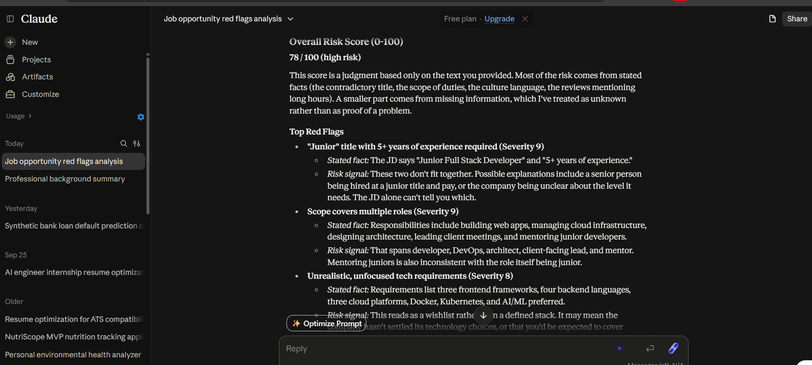
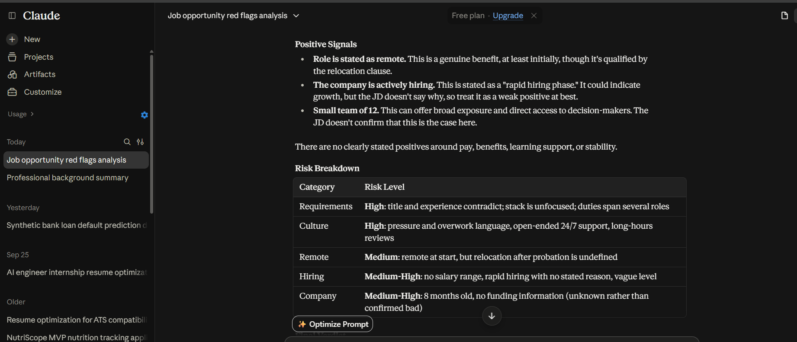
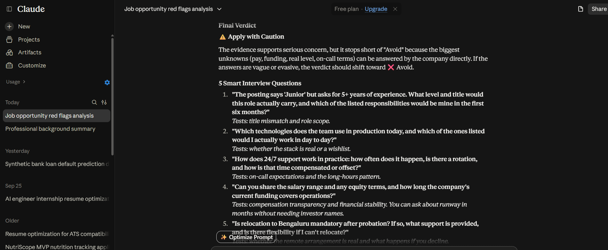

# Day 14 — Job Red Flag Detector with Claude

## Overview

Day 14 of the **60 Days Claude Challenge** focused on using Claude as an AI-powered **Job Red Flag Detector**.

The goal was to understand that a job application is a **two-way evaluation process**. While companies evaluate candidates, candidates should also evaluate job opportunities before investing time in interviews and applications.

For this challenge, I analyzed a sample **Junior Full Stack Developer** opportunity using its Job Description and Company Information.

---

## Objective

The analysis focused on identifying:

- Unrealistic job requirements
- Excessive responsibilities
- Potential workplace culture concerns
- Remote-work and relocation conditions
- Hiring risks
- Company stability signals
- Questions that can be asked during interviews to validate concerns

---

## Job Analyzed

**Role:** Junior Full Stack Developer

### Key Requirements

- 5+ years of experience for a junior-level position
- React, Angular and Vue
- Node.js, Python, Java and Golang
- AWS, Azure and GCP
- Docker and Kubernetes
- AI/ML experience preferred

### Key Responsibilities

- Build web applications
- Manage cloud infrastructure
- Design architecture
- Lead client meetings
- Mentor junior developers
- Provide 24/7 support when needed

### Company Information

- Startup founded 8 months ago
- Team size: 12 employees
- No public funding information provided
- Recent reviews mention long working hours
- Salary range not disclosed
- Rapid hiring phase

---

## Overall Risk Assessment

Claude generated an **Overall Risk Score of 78/100**, categorizing the opportunity as high risk based on the information provided.

The major concerns were the mismatch between the junior title and experience requirement, the unusually broad responsibilities, the very large technology stack, undisclosed compensation, long-working-hours signal and relocation requirement.

> Note: The risk score is Claude's analysis of the provided information, not an official company or job-platform rating.

---

## Top Red Flags

### 1. Junior Title + 5+ Years Experience — Severity 9/10

The role is advertised as a **Junior Full Stack Developer**, while requiring **5+ years of experience**.

This creates a significant mismatch between the stated seniority and experience requirement.

### 2. Multiple Roles Combined — Severity 9/10

The responsibilities extend beyond normal junior full-stack development and include:

- Full-stack development
- Cloud infrastructure
- Architecture
- Client-facing responsibilities
- Mentoring
- 24/7 support

This indicates a very broad scope for a junior position.

### 3. Unfocused Technology Requirements — Severity 8/10

The requirements cover multiple frontend frameworks, backend languages, cloud platforms and infrastructure technologies:

**React + Angular + Vue + Node.js + Python + Java + Golang + AWS + Azure + GCP + Docker + Kubernetes + AI/ML**

This can indicate a broad wishlist rather than a clearly defined technology stack.

### 4. Compensation Not Disclosed

The company information does not provide a salary range.

This makes it difficult to evaluate whether the compensation is appropriate for the responsibilities and experience being requested.

### 5. Workplace Pressure Signals

The description contains phrases such as:

- "Work hard, play hard culture"
- "Fast-paced startup environment"
- "Must thrive under pressure"
- "We are like a family"

The company information also mentions reviews reporting **long working hours**.

These signals should be validated during the interview process rather than treated as definitive proof of a toxic workplace.

### 6. Remote Work + Relocation Condition

The role is described as remote, but **relocation to Bengaluru may be required after probation**.

This is an important condition to clarify before accepting the opportunity.

---

## Positive Signals

Some potentially positive signals were also present:

- Exposure to multiple areas of software engineering
- Opportunity to work with cloud technologies
- Exposure to modern development tools such as Docker and Kubernetes
- Potential exposure to AI/ML
- Small startup environment may provide broad technical exposure
- Rapid hiring may indicate active business growth

These points should be evaluated alongside the risks rather than viewed independently.

---

## Risk Breakdown

| Category | Risk Level |
|---|---|
| Requirements | High |
| Culture | High |
| Remote | Medium |
| Hiring | High |
| Company | Medium–High |

The highest concerns come from the **requirements, role scope and hiring information**, while the remote risk mainly comes from the possible Bengaluru relocation requirement.

---

## Final Verdict

⚠️ **Apply with Caution**

The opportunity contains several signals that should be clarified before investing significant time in the process.

The most important areas to validate are:

- Actual seniority expected for the role
- Compensation range
- Expected working hours
- 24/7 support expectations
- Relocation requirement
- Actual technology stack used by the team
- Company funding and financial stability

---

## 5 Smart Interview Questions

### 1. Role Expectations
**"The role is titled Junior Full Stack Developer but asks for 5+ years of experience. What level of experience are you actually targeting?"**

### 2. Responsibilities
**"How are development, cloud infrastructure, architecture, client meetings and mentoring responsibilities divided within the team?"**

### 3. Working Hours
**"What are the normal working hours, and how frequently is 24/7 support required?"**

### 4. Remote & Relocation
**"Is the role fully remote after probation, or is relocation to Bengaluru eventually mandatory?"**

### 5. Compensation & Company Stability
**"Could you share the compensation range and explain how the company is currently funded?"**

---

## Key Learnings

### 1. Read Beyond the Job Title

A job title does not always accurately represent the expected seniority or responsibilities.

### 2. Check the Full Technology Stack

A long list of technologies may indicate that the employer expects a candidate to cover multiple areas.

### 3. Validate Culture During Interviews

Phrases such as "fast-paced", "work hard, play hard" and "must thrive under pressure" should be followed up with specific questions about working hours and workload.

### 4. Remote Does Not Always Mean Fully Remote

Relocation clauses and post-probation requirements can change the actual work arrangement.

### 5. Missing Information Matters

Undisclosed salary, funding and working-hour expectations are areas where candidates should ask direct questions.

### 6. AI Can Support Job Evaluation

Claude helped organize the information, identify potential risks and generate questions that can be used to investigate those risks further.

---

## Screenshots

### Risk Score & Top Red Flags

### Positive Signals & Risk Breakdown

### Final Verdict & Interview Questions

---

## Tools Used

- Claude
- Job Description + Company Information
- GitHub

---

## Conclusion

Day 14 showed me that job searching should not only be about getting selected.

Candidates should also evaluate:

**Role → Responsibilities → Culture → Compensation → Work Model → Company Stability**

Using AI as a structured analysis partner can help identify questions and potential warning signals before moving forward with an opportunity.

**60 Days Claude Challenge — Day 14/60 🚀**
