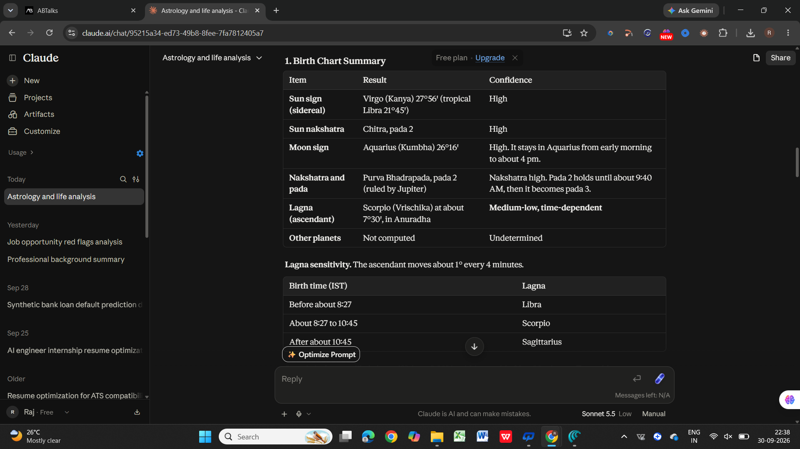
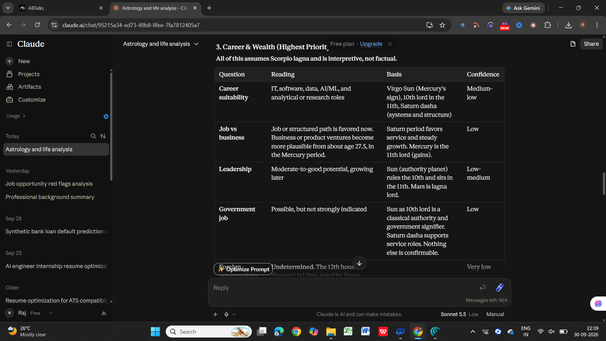
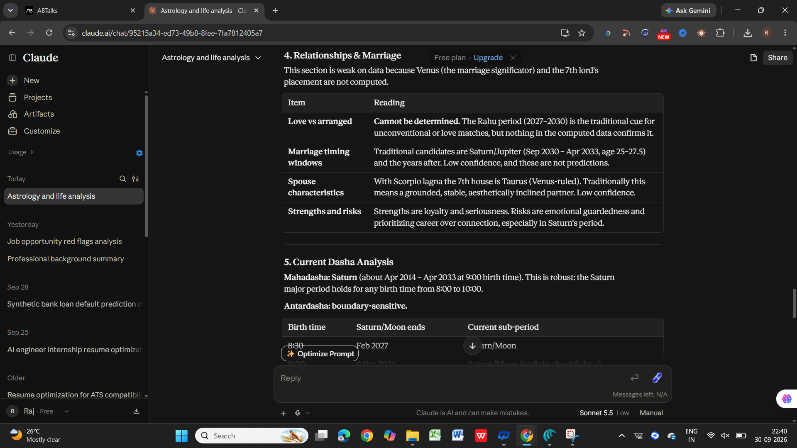
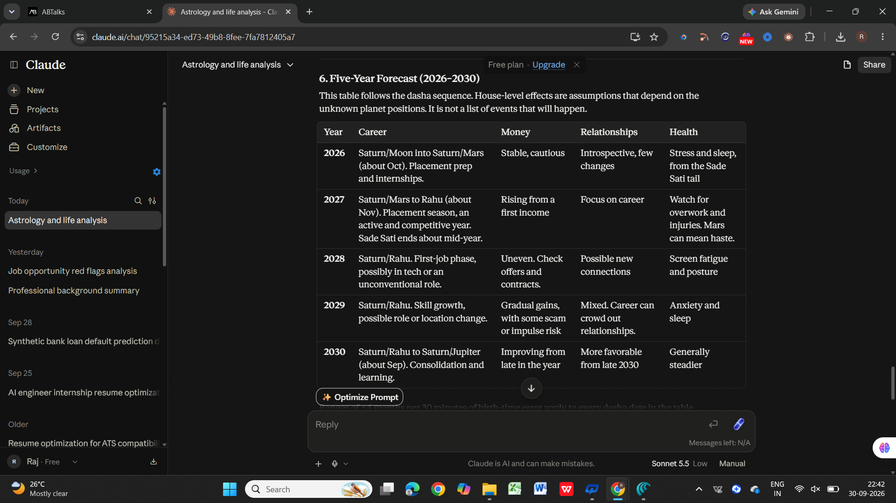

# Day 15 — Astrology & Life Analysis 🔮

## 📌 Objective

For Day 15 of the **60 Days Claude Challenge**, I explored how Claude can use structured personal information to generate a detailed astrology-based life analysis.

### Focus Areas

* Structured input handling
* Multi-step reasoning
* Personalized report generation
* Career and life-pattern analysis
* Forecast generation
* Communicating uncertainty in AI-generated outputs

---

## 🛠️ Tool Used

**Claude AI**

**Effort Level:** Low

---

## 📝 Information Provided

I provided Claude with:

* Name and gender
* Date of birth
* Approximate birth time
* Place of birth
* Current city
* Relationship status
* Profession
* Top 3 concerns

### Main Concerns

1. Career, internships and placements
2. AI/ML, software engineering and long-term career growth
3. Financial growth and future opportunities

---

# 🔮 1. Birth Chart Summary

Claude generated a structured birth-chart analysis covering:

* Sun sign
* Moon sign
* Nakshatra
* Possible Ascendant/Lagna
* House-based interpretations
* Strengths and challenges
* Traditional astrology concepts

### 📸 Screenshot



---

# 💼 2. Career & Wealth Analysis

Claude analyzed career and financial themes based on the provided information and traditional astrology interpretations.

The analysis covered:

* Career suitability
* Technical and analytical fields
* Job vs entrepreneurship
* Leadership tendencies
* Financial growth
* Career timing windows
* Possible professional challenges

### 📸 Screenshot



---

# ❤️ 3. Relationships & Current Dasha

The report explored:

* Relationship patterns
* Commitment and communication
* Traditional marriage timing interpretations
* Current Dasha
* Mahadasha and Antardasha
* Possible life-phase transitions

### 📸 Screenshot



---

# 📅 4. Five-Year Forecast & Remedies

Claude generated a year-by-year interpretation covering:

**2026 → 2027 → 2028 → 2029 → 2030**

The forecast discussed traditional interpretations related to:

* Career
* Finance
* Relationships
* Learning
* Personal development
* Potential challenges
* Traditional remedies

### 📸 Screenshot



---

# 🧠 Key Learnings

### 1. Structured Inputs Matter

Providing complete and organized information helped Claude generate a more structured and personalized response.

### 2. Context Is Important

The quality of an AI response depends heavily on the context and information provided in the prompt.

### 3. Uncertainty Should Be Explicit

My birth time was approximate. Claude therefore highlighted that some calculations, especially the Ascendant and timing-related interpretations, were sensitive to the exact birth time.

This showed the importance of making uncertainty visible instead of presenting every AI-generated result as certain.

### 4. Long Tasks Need Clear Structure

Breaking the request into sections such as:

* Birth chart
* Career
* Wealth
* Relationships
* Dasha
* Forecast
* Recommendations

helped Claude produce a more organized report.

### 5. Detailed Output ≠ Guaranteed Accuracy

A detailed AI-generated report can still contain assumptions or uncertainty.

For this exercise, astrology-based interpretations were treated as a traditional/reflective framework rather than scientifically validated predictions.

---

# 💡 Prompt Engineering Takeaway

A useful structure for complex prompts is:

```text
Context
↓
Personal Information
↓
Task
↓
Required Analysis
↓
Output Structure
↓
Uncertainty Requirements
```

This helped Claude maintain context and generate a consistent long-form response.

---

# 🎯 Final Takeaway

Day 15 demonstrated how Claude can transform structured personal inputs into a detailed and organized report.

The biggest learning was:

> **Clear Context + Structured Prompt + Explicit Uncertainty = Better AI Output**

---

# ✅ Day 15 Status

| Field            | Details                   |
| ---------------- | ------------------------- |
| **Challenge**    | 60 Days Claude Challenge  |
| **Day**          | 15                        |
| **Task**         | Astrology & Life Analysis |
| **Tool**         | Claude                    |
| **Effort Level** | Low                       |
| **Status**       | Completed ✅               |

