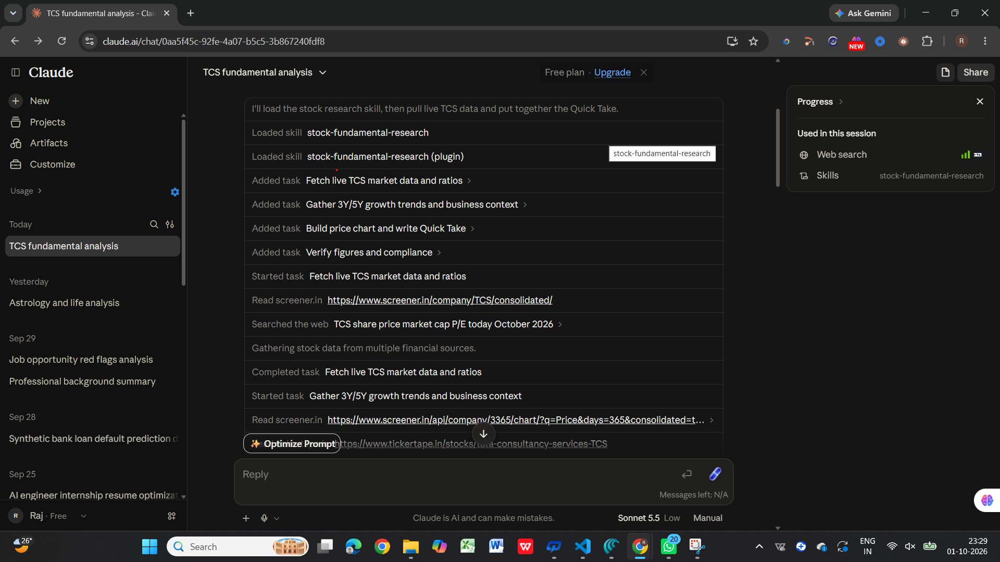
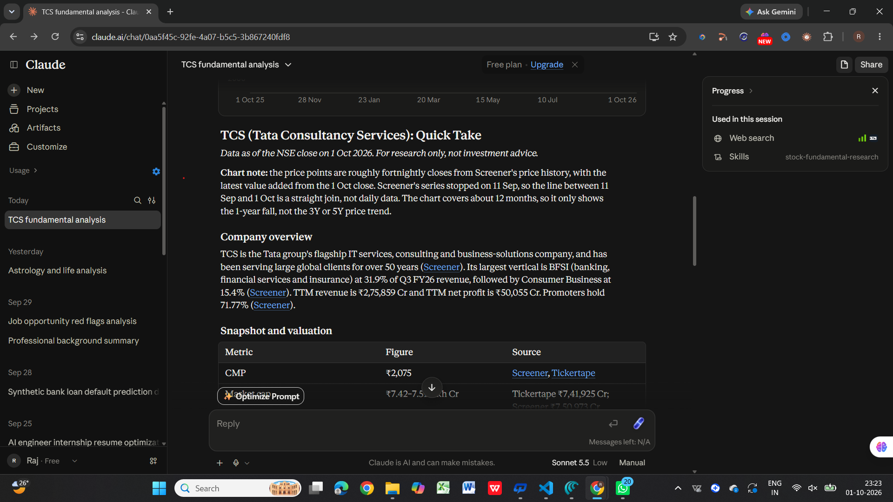
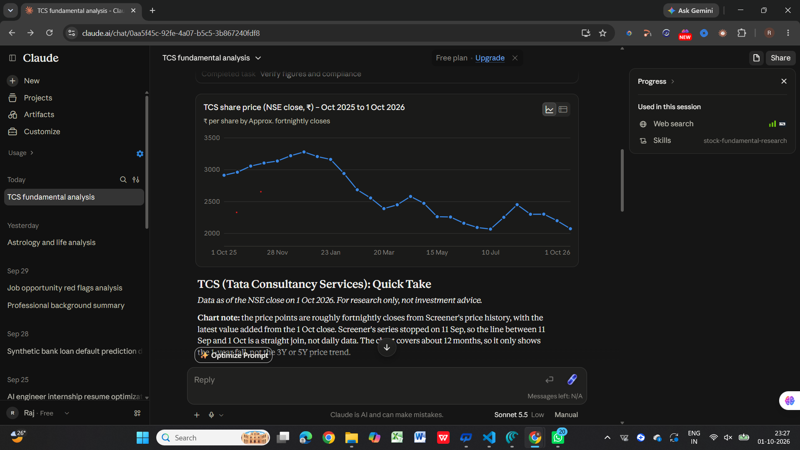

# Day 16 — Stock Fundamental Research Custom Skill

## 🎯 Objective

Today, I created a reusable Claude Custom Skill called **`stock-fundamental-research`** for structured fundamental analysis of Indian and global listed companies.

The goal was to build a reusable workflow that can analyze companies using financial data, valuation, growth, financial health, ownership, business quality, risks, and peer comparison without giving direct buy/sell/hold recommendations.

---

## 🧠 What I Built

### Custom Skill

**Skill Name:** `stock-fundamental-research`

The skill analyzes companies using:

* Company fundamentals
* Financial statements
* Valuation metrics
* Revenue and profit growth
* Debt and financial health
* ROE and ROCE
* Free cash flow
* Ownership trends
* Business quality and competitive advantages
* Management and governance
* Sector trends
* Risks and watch-points
* Peer comparison
* Price charts

### Skill Creation Screenshot

---

## 🔬 Test Case — TCS

I tested the custom skill using **Tata Consultancy Services (TCS)** in **Quick Take mode**.

The skill generated a structured report containing:

* Company overview
* Current Market Price (CMP)
* Market capitalization
* 52-week high/low
* P/E and P/B
* Valuation assessment
* Debt-to-Equity
* ROE and ROCE
* 3Y/5Y growth trends
* Key strengths
* Watch-points and risks
* Fundamental quality assessment
* Price chart

### TCS Quick Take Report

---

## 📈 Price Chart

The skill also generated a price chart to visualize TCS's recent price movement.

---

## 📊 Key Findings from the TCS Test

Some important observations generated by the skill were:

* TCS showed strong profitability with high ROE and ROCE.
* The company maintained a relatively low debt-to-equity ratio.
* Free cash flow remained strong relative to net profit.
* Revenue and profit growth were positive but comparatively moderate over the 3–5 year period.
* The report highlighted slower growth and margin pressure as important watch-points.
* The analysis used multiple sources and explicitly identified figures that could not be independently cross-checked.
* The report avoided direct buy, sell, or hold recommendations.

---

## 🛠️ Prompt Engineering Concepts Used

### 1. Structured Prompting

I separated the skill into clear sections such as:

* Role
* Research rules
* Required metrics
* Interpretation rules
* Output modes
* Evidence requirements
* Restrictions

### 2. Role-Based Prompting

The skill establishes a specific role for the AI as a **fundamental stock research analyst**.

### 3. Context Engineering

The skill provides detailed context about:

* What data to collect
* Which sources to prioritize
* How to interpret financial metrics
* What the final report should contain

### 4. Reusable Workflow

Instead of repeatedly writing the same long instructions, I created a reusable Custom Skill that can be loaded whenever I need stock fundamental research.

---

## 📚 What I Learned

* How to create a reusable Custom Skill in Claude.
* How structured instructions improve consistency.
* How to define multiple workflows inside one skill.
* How to specify evidence and source requirements.
* How financial metrics such as P/E, P/B, ROE, ROCE, D/E and FCF are used in fundamental analysis.
* How to make AI-generated research more transparent by identifying unavailable or unverified data.
* How reusable AI workflows can reduce repetitive prompting.

---

## 💡 Key Takeaway

The biggest learning from Day 16 was that a well-designed prompt can be converted into a **reusable AI workflow**.

Instead of repeatedly explaining how I want a stock to be analyzed, I can load the `stock-fundamental-research` skill and use the same structured research process for different companies.

This makes the workflow more consistent, reusable, and efficient.

---

## ⚠️ Important Note

The generated research is for educational and research purposes only. Financial figures can change and should be independently verified from reliable sources.

The skill is specifically designed **not to provide direct buy, sell, or hold recommendations**.

---

## 🚀 Day 16 Outcome

| Item          | Details                                                                                          |
| ------------- | ------------------------------------------------------------------------------------------------ |
| Custom Skill  | `stock-fundamental-research`                                                                     |
| Test Company  | TCS                                                                                              |
| Mode Tested   | Quick Take                                                                                       |
| Output        | Fundamental research report + price chart                                                        |
| Main Concepts | Custom Skills, Structured Prompting, Context Engineering, Research Workflows, Financial Analysis |

---

## 🔗 Repository

**GitHub Repository:** `RajRao-143/60-days-of-claude`

**Challenge:** ABTalks 60 Days Claude Challenge

**Day:** 16/60
