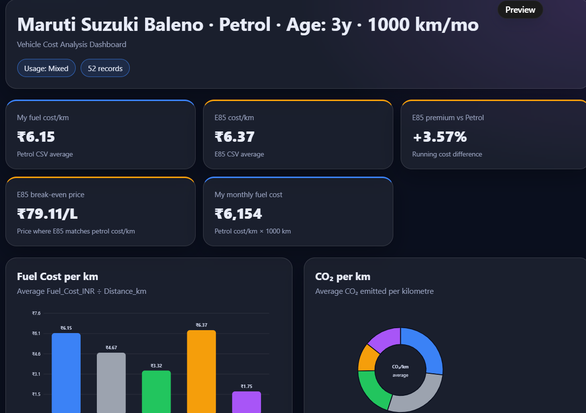
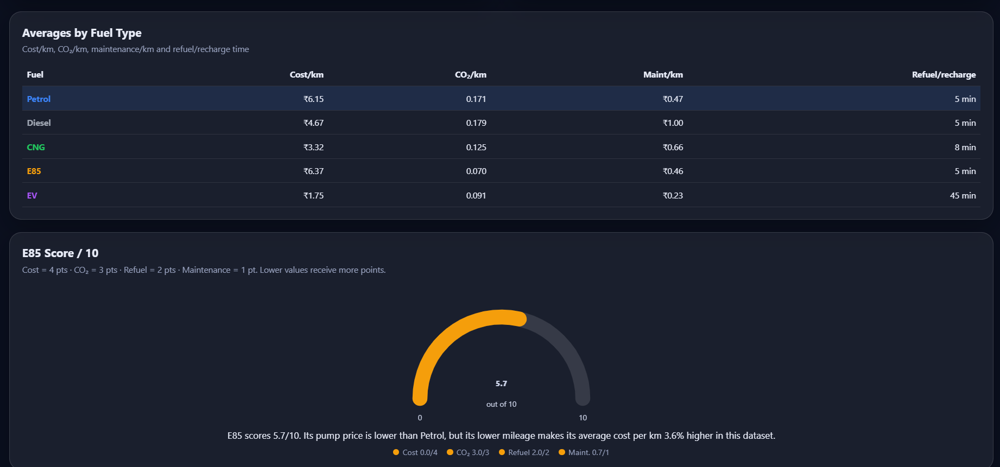
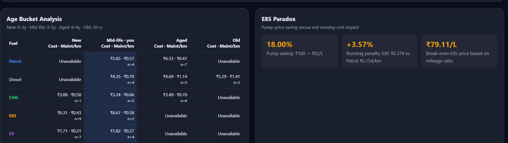
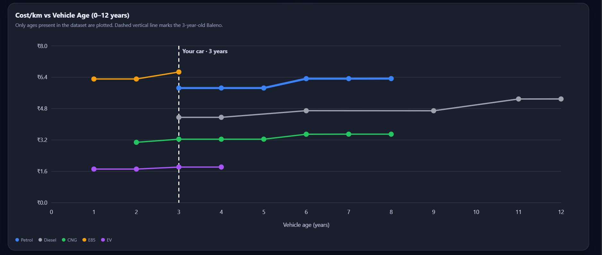

# 🚗 Day 17 — Vehicle Cost Analysis Dashboard

## 📌 Overview

For Day 17 of the **ABTalks 60 Days Claude Challenge**, I built a **Vehicle Cost Analysis Dashboard** using Claude.

The objective was to analyze vehicle running costs, fuel efficiency, maintenance expenses, CO₂ emissions, vehicle age, and E85 economics using a CSV dataset and present the insights through an interactive dashboard.

---

## 🚘 Vehicle Details

| Parameter     | Value                |
| ------------- | -------------------- |
| Vehicle       | Maruti Suzuki Baleno |
| Fuel          | Petrol               |
| Usage         | Mixed                |
| Monthly Usage | 1000 km              |
| Vehicle Age   | 3 years              |

---

## 🛠️ Technologies Used

* HTML
* CSS
* Vanilla JavaScript
* SVG
* CSV Data Analysis
* Claude

---

## 📊 Dashboard Features

The dashboard contains:

* 5 KPI cards
* Fuel Cost/km comparison
* CO₂/km comparison
* Cost/km vs Vehicle Age
* Age Bucket Analysis
* E85 Paradox Analysis
* E85 Break-even Analysis
* E85 Score / 10
* Fuel Comparison Cards
* Fuel Averages and Maintenance Comparison

---

## 📸 Dashboard Screenshots

### 1. Dashboard Overview



### 2. Fuel Comparison



### 3. E85 Analysis



### 4. Age Cost Analysis



---

## 🌐 Interactive Dashboard

The complete interactive HTML dashboard can be opened directly in a browser:

**[👉 Open Vehicle Cost Analysis Dashboard](./day17-dashboard.html)**

The dashboard uses pure HTML, CSS, and vanilla JavaScript without external libraries or CDNs.

---

## 🔍 Analysis Performed

Using the attached vehicle dataset, I analyzed:

1. Average fuel cost per kilometre
2. Average CO₂ emissions per kilometre
3. Average maintenance cost per kilometre
4. Average refueling/recharging time
5. Cost/km across different vehicle-age groups
6. Maintenance cost/km across age groups
7. E85 pump-price savings
8. E85 running-cost penalty compared with Petrol
9. E85 break-even price
10. E85 Score based on cost, CO₂, refueling time, and maintenance

---

## ⛽ E85 Paradox

A major part of this dashboard was understanding the **E85 Paradox**.

E85 can have a lower pump price than Petrol, but its lower fuel economy can affect the actual running cost.

Therefore, I compared:

* Pump-price saving
* Running-cost penalty
* Break-even price
* CO₂ impact
* Refueling time
* Maintenance cost

This showed why comparing only the price displayed at the fuel pump does not provide the complete picture of fuel economics.

---

## 📈 Visualizations

The dashboard uses different visualizations for different analytical purposes:

| Visualization  | Purpose                               |
| -------------- | ------------------------------------- |
| Bar Chart      | Compare Cost/km across fuels          |
| Doughnut Chart | Compare CO₂/km                        |
| Line Chart     | Analyze Cost/km with vehicle age      |
| Gauge          | Display E85 Score                     |
| KPI Cards      | Highlight important metrics           |
| Tables         | Compare detailed fuel and age metrics |

---

## 🧠 Key Learnings

### CSV Analysis

I learned how raw CSV data can be transformed into meaningful business metrics.

### Business Metrics

I practiced calculating metrics such as:

* Cost/km
* Maintenance Cost/km
* CO₂/km
* Break-even price

### Data Visualization

I learned how different chart types can communicate different insights more effectively.

### Dashboard Development

I learned how HTML, CSS, JavaScript, and SVG can be combined to build a self-contained analytical dashboard.

---

## ⚠️ Challenge Faced

The first generated HTML displayed the dashboard structure, but the KPI values and visualizations were not rendering correctly because of JavaScript and escaping issues.

I identified the rendering problem and generated a corrected browser-ready HTML dashboard using pure HTML, CSS, and JavaScript.

---

## 🤖 How I Used Claude

I used Claude as a development and data-analysis assistant to:

* Analyze the vehicle CSV dataset
* Calculate business metrics
* Analyze E85 economics
* Design the dashboard
* Generate SVG visualizations
* Build the HTML/CSS/JavaScript dashboard
* Debug the initial rendering issue

---

## 📁 Project Files

```text
Day17/
│
├── day17.md
├── day17-dashboard.html
├── day17-dashboard-overview.png
├── day17-fuel-comparison.png
├── day17-e85-analysis.png
└── day17-age-cost-chart.png
```

### Files

* [📊 Interactive Dashboard](./day17-dashboard.html)
* [🖼️ Dashboard Overview](./day17-dashboard-overview.png)
* [⛽ Fuel Comparison](./day17-fuel-comparison.png)
* [📈 E85 Analysis](./day17-e85-analysis.png)
* [📉 Age Cost Analysis](./day17-age-cost-chart.png)

---

## 🎯 Learning Objectives Covered

* ✅ CSV Analysis
* ✅ Dashboard Creation
* ✅ Business Metrics
* ✅ Data Visualization

---

## 🚀 Outcome

This challenge helped me understand the complete flow from:

**Raw CSV Data → Data Analysis → Business Metrics → Visualization → Interactive Dashboard**

Day **17/60** completed. 🚀

#60DayClaudeChallenge #Claude #PromptEngineering #DataAnalysis #DataVisualization #LearningInPublic
