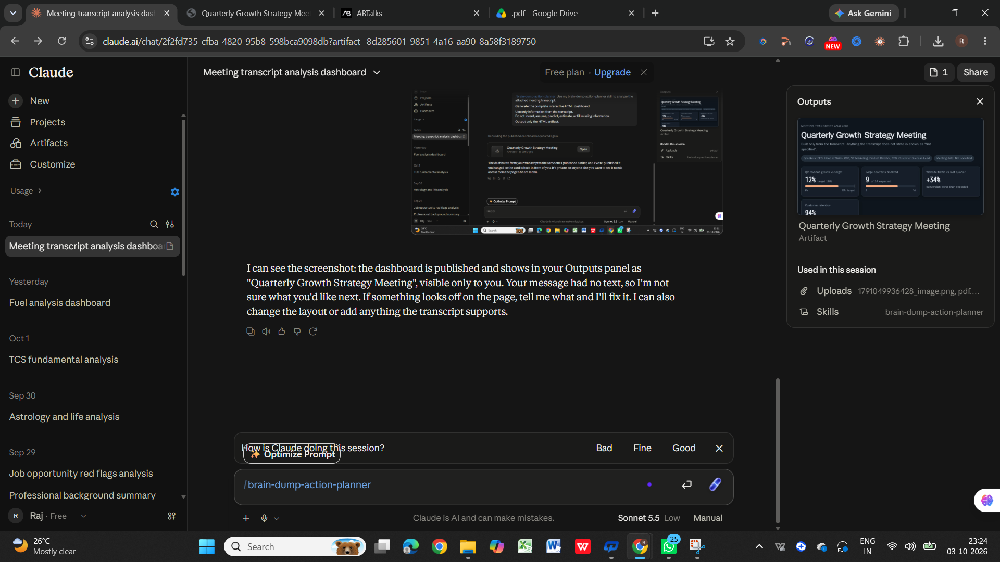
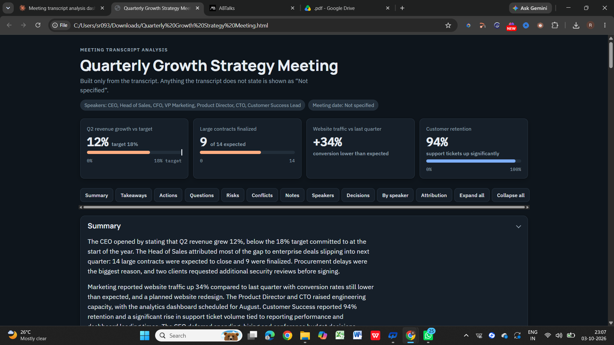
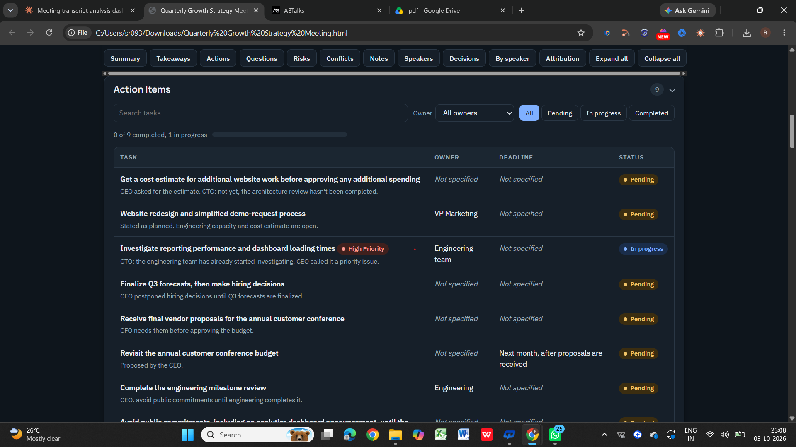

# Day 18 — Brain Dump Action Planner

## 🚀 Overview

For Day 18 of the #60DayClaudeChallenge, I built a reusable Claude Custom Skill called **Brain Dump Action Planner**.

The goal was to transform messy notes, meeting transcripts, brainstorming sessions, and project discussions into structured and actionable information.

The skill organizes unstructured information into:

* Summary
* Key Takeaways
* Action Items
* Open Questions
* Risks & Blockers
* Conflicts
* Additional Notes
* Speaker-wise information for transcript analysis

It also follows an important rule: **never invent missing information**. When something is not provided, it is shown as **"Not specified"**.

---

## 🧠 Custom Skill

**Skill Name:** `brain-dump-action-planner`

**Purpose:**
Transform unstructured information into structured summaries, decisions, questions, risks, and task lists.

### Skill Setup Screenshot

---

## 📝 Test Input

I tested the skill using a **Quarterly Growth Strategy Meeting** transcript.

The meeting covered topics including:

* Revenue growth and targets
* Customer contracts
* Procurement and security-review delays
* Marketing and conversion
* Analytics dashboard development
* Engineering capacity
* Customer retention
* Support issues
* Reporting performance
* Hiring plans
* Conference budget
* Product release commitments

---

## 📊 Generated Dashboard

Claude transformed the meeting transcript into an interactive dashboard containing structured information that can be reviewed and acted upon.

### Dashboard Overview

### Action Items

---

## 🌐 Interactive Dashboard

The complete generated HTML artifact is available here:

👉 [Open Brain Dump Action Planner Dashboard](./brain-dump-dashboard.html)

---

## 💡 Key Learnings

### 1. Reusable AI Workflows

Custom Skills can convert repetitive tasks into reusable AI workflows.

### 2. Information Management

Unstructured discussions can be organized into clear summaries, decisions, tasks, questions, and risks.

### 3. Project Planning

Structuring action items with task, owner, deadline, and status makes meeting outcomes easier to track.

### 4. Avoiding Assumptions

AI should not fill gaps with guesses. Missing information should be clearly marked as **"Not specified"**.

### 5. Interactive AI Artifacts

Claude can turn structured information into a complete interactive HTML dashboard instead of returning only plain text.

---

## 🎯 Challenge Takeaway

Day 18 showed me how AI can go beyond simple text generation and help convert unstructured information into a **structured, actionable workflow**.

**Day 18/60 completed 🚀**

#60DayClaudeChallenge #Claude #PromptEngineering #AI #GenerativeAI #AIEngineering #Productivity #LearningInPublic
