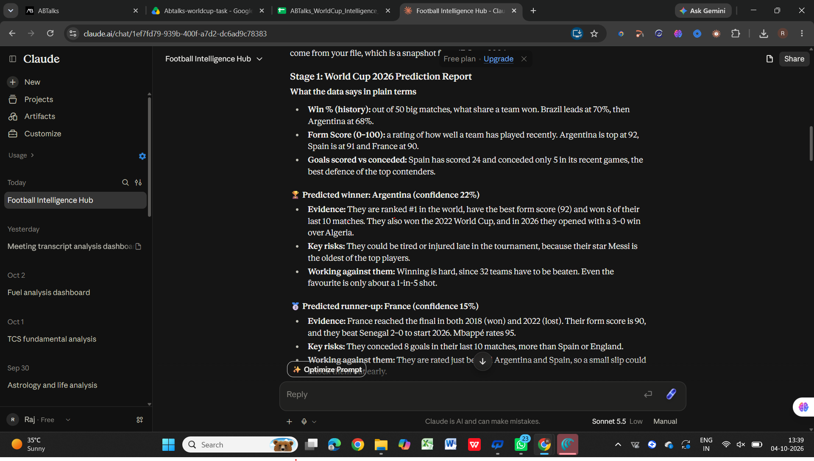
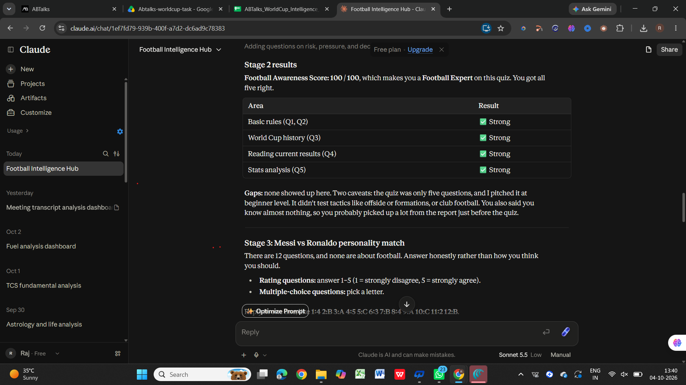
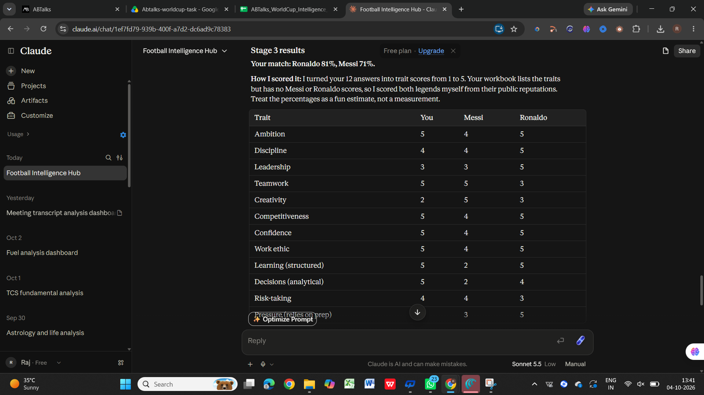
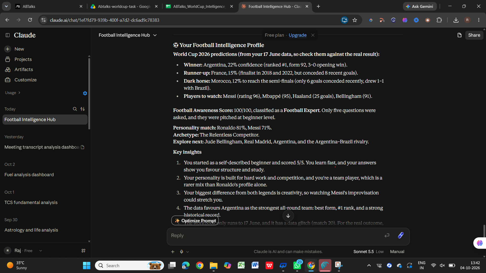

# ⚽ Day 19 — Football Intelligence Hub

## 🎯 Challenge Overview

For Day 19 of the **60 Days Claude Challenge**, I built and tested a **Football Intelligence Hub** using Claude.

The experience combines **sports analytics, prediction systems, interactive quizzes, and personality-based personalization** into one workflow.

The uploaded workbook was used as the primary data source.

---

## 🧠 Stage 0 — Football Knowledge Check

I started as a beginner and selected:

> **“I know almost nothing.”**

Claude adjusted the explanations and quiz difficulty accordingly.

---

## 🏆 Stage 1 — FIFA World Cup 2026 Prediction Report

Claude analyzed the workbook's historical team performance, recent form, current tournament results, and player statistics.

### Predictions

| Category      | Prediction                     | Confidence |
| ------------- | ------------------------------ | ---------: |
| 🏆 Winner     | Argentina                      |        22% |
| 🥈 Runner-up  | France                         |        15% |
| 🐎 Dark Horse | Morocco — Semi-final potential |        12% |

### ⭐ Players to Watch

* **Lionel Messi** — Rating 96, 20 goals, 12 assists
* **Kylian Mbappé** — Rating 95, 22 goals
* **Erling Haaland** — 25 goals
* **Jude Bellingham** — Rating 91, 10 goals, 9 assists

### 📸 Prediction Report

---

## 🧠 Stage 2 — Football IQ Quiz

I completed a 5-question Football IQ quiz covering:

* Basic football rules
* World Cup knowledge
* Football history
* Current match results
* Statistical analysis

### Result

**Football Awareness Score: 100/100**

**Classification: Football Expert**

> Note: The quiz contained only five questions and was initially designed at beginner level, so this score should not be interpreted as a comprehensive measure of football expertise.

### 📸 Football IQ Result

---

## 🧩 Stage 3 — Messi vs Ronaldo Personality Match

The final stage used personality-based questions covering traits such as:

* Ambition
* Discipline
* Leadership
* Teamwork
* Creativity
* Competitiveness
* Confidence
* Work ethic
* Learning style
* Decision-making
* Risk-taking
* Performance under pressure

### Personality Match

| Player                 | Compatibility |
| ---------------------- | ------------: |
| 🇵🇹 Cristiano Ronaldo |       **81%** |
| 🇦🇷 Lionel Messi      |       **71%** |

### 🏆 Personality Archetype

**The Relentless Competitor**

Key characteristics:

* High ambition
* Strong work ethic
* Competitive mindset
* Structured learning
* Analytical decision-making
* Team-oriented approach
* Strong preparation under pressure

### 📸 Personality Match

---

## ⚽ Final Football Intelligence Profile

### 🏆 World Cup Prediction

**Winner:** Argentina
**Runner-up:** France
**Dark Horse:** Morocco

### 🧠 Football Awareness

**100/100 — Football Expert**

### 🧩 Personality

**Ronaldo: 81%**
**Messi: 71%**

### 🔥 Archetype

**The Relentless Competitor**

### ⭐ Recommended Exploration

* **Player:** Jude Bellingham
* **Club:** Real Madrid
* **National Team:** Argentina
* **Rivalry:** Argentina vs Brazil

### 📸 Final Profile

---

## 💡 Key Learnings

### 1. Sports Analytics

I learned how historical performance, recent form, goals scored/conceded, rankings, and player statistics can be combined to create a prediction report.

### 2. Prediction Systems

The experience showed me that predictions should include not only a prediction but also:

* Confidence
* Supporting evidence
* Risks
* Factors working against the prediction

### 3. Interactive Quizzes

Claude can turn a static dataset into an interactive experience where the user answers questions and receives a personalized result.

### 4. Personalization

The same system adapted its explanations based on my football knowledge level and then used my personality responses to generate a personalized football profile.

### 5. Data Quality Matters

The workbook contained a data inconsistency in one of the listed matches. This showed me why data validation is important before using a dataset for analysis or predictions.

---

## 🛠️ What I Built

**Football Intelligence Hub**

A multi-stage AI experience combining:

**Workbook → Knowledge Assessment → Sports Prediction → Football IQ Quiz → Personality Analysis → Personalized Profile**

---

## 📚 Skills Practiced

* Sports Analytics
* Data Analysis
* Prediction Systems
* Interactive AI Experiences
* Personalization
* Quiz Design
* Data Quality Checking
* Prompt Engineering
* Claude Custom Workflows

---

## 🚀 Day 19 Complete

Day 19 helped me understand how structured data can be transformed into an **interactive, personalized AI experience** rather than just a static analysis.

**Day 19/60 completed! 🚀**

#60DayClaudeChallenge #60DaysOfClaudeChallenge #Claude #Anthropic #AI #GenerativeAI #SportsAnalytics #PromptEngineering #AIEngineering #LearningInPublic #ABTalks

