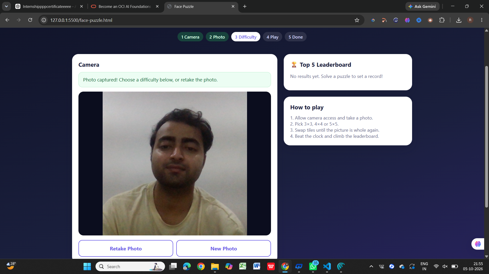
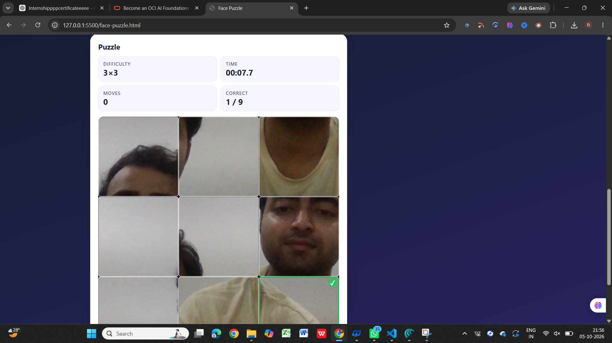
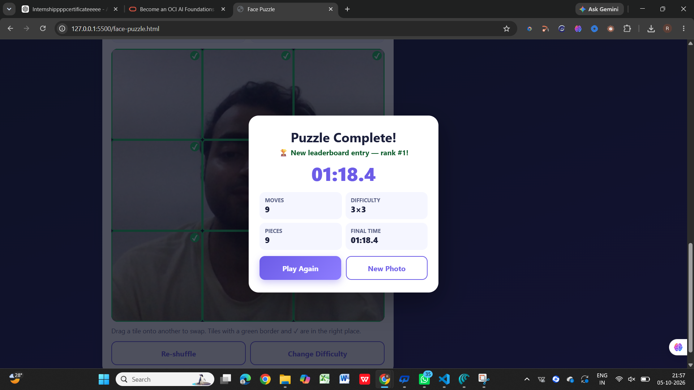

# Day 20 — Face Puzzle Game 🧩📸

## 🎯 Objective

For Day 20 of the **ABTalks 60 Days Claude Challenge**, I built a fully functional **Face Puzzle Game** using HTML, CSS, and JavaScript.

The game uses the webcam to capture a photo and converts it into an interactive puzzle with different difficulty levels.

### Key Learning Objectives

* 🎮 Game Development
* 📷 Camera & Web APIs
* 🖼️ Image Processing
* 🖱️ Drag & Drop Interaction
* 📱 Responsive UI
* 💾 Local Storage
* ⚡ Interactive User Experience

---

## ✨ Features

* 📸 Webcam photo capture
* 🔄 Retake Photo / New Photo
* 🧩 3×3, 4×4 and 5×5 puzzle modes
* 🖱️ Mouse interaction
* 📱 Touch interaction
* 👆 Pointer Events
* ⏱️ Live puzzle timer
* 🔢 Move counter
* ✅ Correct-piece counter
* 🏆 Automatic win detection
* 🎉 Puzzle completion results
* 💾 Top 5 leaderboard using `localStorage`
* 📅 Date, time, moves and difficulty tracking
* 📱 Responsive design for desktop and mobile
* 🔒 Captured photos remain local to the browser

---

## 📸 Screenshots

### 1. Camera & Photo Capture

The game successfully accesses the webcam and allows the user to capture a photo for the puzzle.



---

### 2. Puzzle Gameplay

The captured image is divided into puzzle pieces and can be rearranged using mouse or touch interaction.



---

### 3. Puzzle Completed & Leaderboard

After completing the puzzle, the game displays the final result and saves the score to the local leaderboard.



---

## 🛠️ Technologies Used

* HTML5
* CSS3
* JavaScript
* Web Camera API
* Canvas API
* Pointer Events API
* LocalStorage API

---

## 🧠 How It Works

### 1. Capture Photo

The application requests webcam permission using the browser's camera API and captures the current video frame onto a canvas.

### 2. Generate Puzzle

The captured image is divided into equal pieces according to the selected difficulty.

### 3. Shuffle

The puzzle is shuffled while maintaining a solvable game state.

### 4. Play

Players rearrange the tiles using mouse or touch interaction.

### 5. Track Progress

The application continuously tracks:

* Elapsed time
* Number of moves
* Correctly positioned pieces

### 6. Detect Completion

When all puzzle pieces are in their correct positions, the game automatically detects completion and displays the results.

### 7. Save Score

The best results are stored locally using `localStorage` and displayed in the leaderboard.

---

## 💡 Prompt Engineering Approach

For this project, I used the **R-C-I-F-S framework** from the Prompt Engineering Handbook:

* **Role** — Senior Front-End Developer & UI/UX Engineer
* **Context** — ABTalks Day 20 Face Puzzle Game
* **Instruction** — Build a complete single-file working application
* **Format** — One self-contained HTML file
* **Structure** — Camera → Photo → Difficulty → Puzzle → Results → Leaderboard

I also added explicit constraints, browser compatibility requirements, solvability requirements, and a self-validation checklist to make the generated application more reliable.

---

## 📚 What I Learned

* How browser camera access works with `getUserMedia()`
* How to capture video frames using Canvas
* How images can be divided into puzzle tiles
* How Pointer Events can support mouse and touch interactions
* How to manage game state in JavaScript
* How to implement timers and move counters
* How to detect puzzle completion
* How to store and retrieve data using `localStorage`
* How detailed prompting improves generated code quality
* How to test and validate an AI-generated application before publishing it

---

## 🚀 Project Outcome

I successfully built and tested a working **Face Puzzle Game** that combines camera access, image processing, interactive gameplay, responsive UI, and local leaderboard functionality in a single HTML file.

This project helped me understand how **prompt engineering + web development + browser APIs** can be combined to build a complete interactive application.

---

## 📁 Project Files

```text
Day20/
├── face-puzzle.html
├── day20-camera.png
├── day20-gameplay.png
├── day20-result-leaderboard.png
└── day20.md
```

---

## 🔗 Challenge

**ABTalks — 60 Days Claude Challenge**

Day 20: **Face Puzzle Game** 🧩📸

