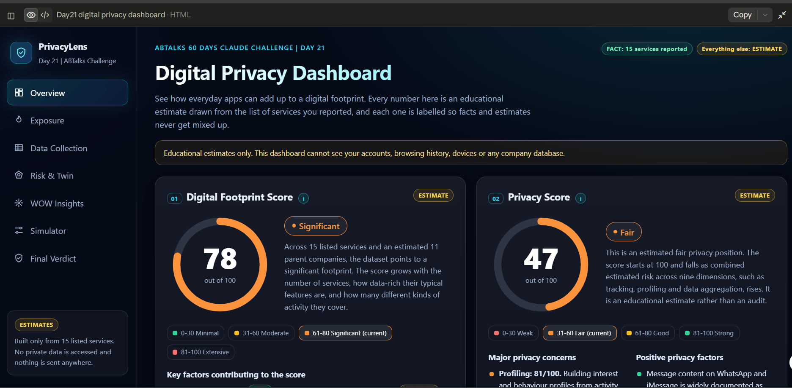
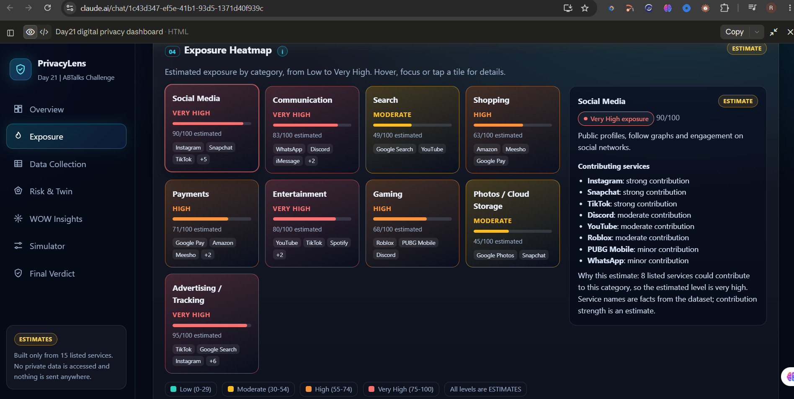
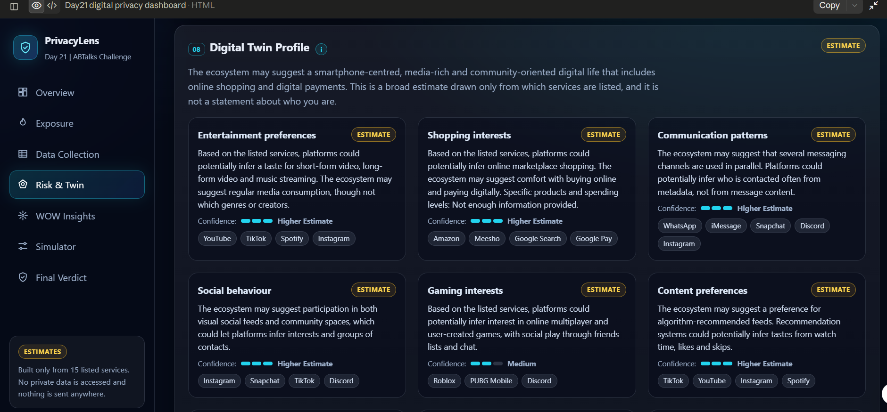

# Day 21 — Digital Privacy Dashboard 🔐📊

## 🎯 Objective

For Day 21 of the **ABTalks 60 Days Claude Challenge**, I built an interactive **Digital Privacy Dashboard** using Claude.

The goal was to understand how the digital services we use can contribute to our overall digital footprint and potential privacy exposure.

The dashboard analyzes a sample dataset of 15 digital services and presents the results through interactive visualizations and privacy insights.

---

## 🧠 What I Built

I created a premium cybersecurity-style dashboard that analyzes:

* Digital Footprint Score
* Privacy Score
* Exposure Heatmap
* Company Exposure Ranking
* Data Collection Matrix
* Risk Radar
* Digital Twin Profile
* WOW Insights
* Most Valuable Data Assets
* Privacy Improvement Simulator
* Final Verdict

---

## 📊 Baseline Analysis

Based on the provided 15-service dataset, the dashboard generated:

| Metric                     |             Result |
| -------------------------- | -----------------: |
| Digital Footprint Score    |         **78/100** |
| Privacy Score              |         **47/100** |
| Ecosystem Concentration    |         **46/100** |
| Parent Companies           | **11 (Estimated)** |
| Estimated Tracking Surface |         **96/150** |

> ⚠️ These scores are analytical estimates based only on the provided dataset. They are not measurements of my actual private data or a professional security audit.

---

## 📱 Sample Digital Footprint

The dashboard analyzed these services:

**Instagram, Snapchat, TikTok, YouTube, Discord, WhatsApp, iMessage, Spotify, Roblox, PUBG Mobile, Amazon, Meesho, Google Search, Google Pay, Google Photos**

These services were treated as the only confirmed **FACTS** provided for the analysis.

Any behavioural, demographic, lifestyle, shopping, entertainment, payment, mobility, or technology-related conclusions were treated as **ESTIMATES**.

---

# 🔍 Dashboard Sections

## 1. Digital Footprint Score

The dashboard estimated my overall digital footprint as:

### 🟠 78/100 — Significant

The score represents an analytical estimate based on the number and types of digital services present in the dataset.



---

## 2. Privacy Score

The estimated Privacy Score was:

### 🟠 47/100 — Fair

The dashboard highlights potential privacy exposure while clearly stating that the score is an estimate and not a professional security assessment.

---

## 3. Exposure Heatmap

The Exposure Heatmap visualizes estimated exposure across categories such as:

* Social Media
* Communication
* Search
* Shopping
* Payments
* Entertainment
* Gaming
* Photos / Cloud Storage
* Advertising / Tracking



---

## 4. Company Exposure Ranking

The dashboard groups services according to their inferred parent-company ecosystems and estimates the potential data surface created by using multiple services.

The analysis does **not** claim that any company definitely possesses specific private information.

---

## 5. Digital Twin Profile

The Digital Twin section explores what platforms could potentially infer from the combination of services.

Examples include possible:

* Entertainment preferences
* Shopping interests
* Gaming interests
* Communication patterns
* Content preferences
* Technology preferences

These are explicitly treated as **ESTIMATES**, not confirmed personal characteristics.



---

## 6. Risk Radar

The Risk Radar provides an estimated visualization across privacy-related dimensions such as:

* Tracking
* Profiling
* Advertising
* Data Aggregation
* Account Linking
* Social Graph Exposure
* Financial Data Exposure
* Location Exposure
* Cloud Data Exposure

The purpose is to make potential privacy risks easier to understand visually.

---

## 7. Most Valuable Data Assets

The dashboard also analyzes potentially valuable data categories such as:

* Identity
* Social Graph
* Search History
* Purchase History
* Payment Activity
* Location Signals
* Photos
* Communication Metadata
* Entertainment Preferences
* Behavioural Patterns

These represent potential privacy-sensitive categories based on service functionality, not confirmed data possession.

---

# 🧪 Privacy Improvement Simulator

One of the most interesting parts of the project was the interactive **Privacy Improvement Simulator**.

It allows services to be removed from the simulated ecosystem and dynamically recalculates:

* Privacy Score
* Digital Footprint Score
* Tracking Surface
* Ecosystem Concentration

For example, removing selected services produced an estimated improvement from:

**Privacy Score: 47 → 64**

**Digital Footprint: 78 → 54**

**Tracking Surface: 96 → 53**

These results are only simplified simulations and should not be interpreted as guaranteed real-world privacy improvements.


---

# 🛠️ Technologies Used

* HTML
* CSS
* JavaScript
* Interactive Data Visualization
* Browser-based UI
* Responsive Web Design
* Client-side Simulation
* Claude AI

No backend or personal database was used.

---

# 🧠 Prompt Engineering Approach

For this project, I applied the **R-C-I-F-S framework** from the Prompt Engineering Study Handbook:

### R — Role

Defined Claude as a senior privacy engineer, cybersecurity analyst, data visualization specialist, and front-end developer.

### C — Context

Provided the ABTalks Day 21 challenge, objective, dataset, and privacy-analysis requirements.

### I — Instruction

Specified the exact dashboard sections, calculations, interactions, privacy rules, and technical requirements.

### F — Format

Required a complete self-contained HTML artifact.

### S — Structure

Defined the dashboard architecture, visual sections, simulator, charts, disclaimer, and validation requirements.

I also used **constraints, fact-vs-estimate separation, and self-validation** to make the output more reliable.

---

# 🔐 Privacy & Safety Rules

A major focus of this project was avoiding unsupported claims.

The dashboard:

* Uses only the provided dataset.
* Does not access private accounts.
* Does not access browsing history.
* Does not access device information.
* Does not access company databases.
* Does not claim real-time tracking information.
* Separates **FACTS** from **ESTIMATES**.
* Uses "Not enough information provided." when information cannot reasonably be inferred.

### Disclaimer

> This dashboard provides educational estimates based only on the services listed in the provided dataset. It does not access private accounts, browsing history, device information, company databases, or real-time tracking data. Inferred characteristics are estimates and should not be treated as confirmed facts or a professional security audit.

---

# 💡 What I Learned

Through this project, I learned how AI can be used to build more than simple webpages.

I explored how Claude can help create an interactive cybersecurity dashboard involving:

* Privacy analysis
* Risk assessment
* Data visualization
* Digital footprint modeling
* Digital twin concepts
* Interactive simulations
* Responsive UI development

I also learned that **good AI output depends heavily on good prompt structure**.

Clearly defining the role, context, requirements, constraints, output format, and validation rules produced a much more complete result.

---

# 📁 Project Structure

```text
Day21/
├── day21-digital-privacy-dashboard.html
├── day21-overview.png
├── day21-heatmap.png
├── day21-digital-twin.png
├── day21-simulator.png
└── day21.md
```

---

# 🚀 Project Outcome

Day 21 helped me understand how **privacy analysis + data visualization + interactive web development + prompt engineering** can be combined into a single practical project.

Instead of simply generating a static webpage, I focused on building something that allows users to **explore, understand, and simulate privacy-related decisions**.

**Day 21/60 — Building by doing. 🚀**

---

## 🏷️ Tags

`#60DaysClaudeChallenge` `#ABTalks` `#ClaudeAI` `#Privacy` `#CyberSecurity` `#WebDevelopment` `#JavaScript` `#DataVisualization` `#PromptEngineering` `#LearningInPublic`

