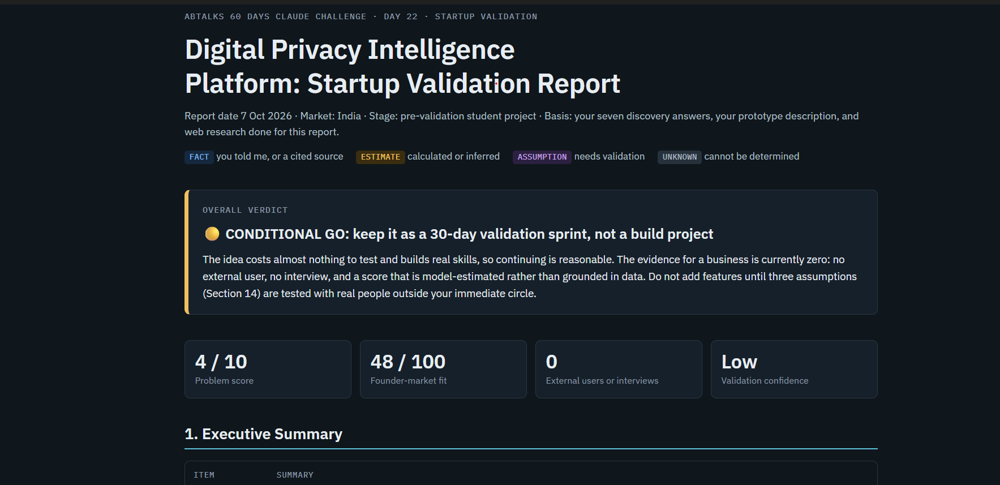
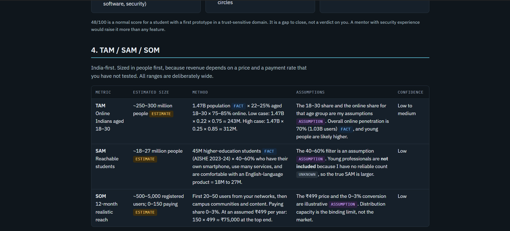
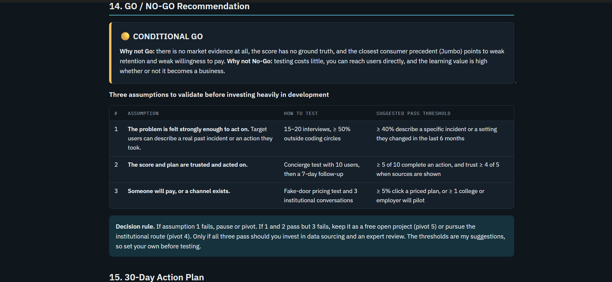

# Day 22 — Startup Validation 🚀

## 🎯 Objective

The goal of Day 22 was to validate my startup idea before investing significant time and resources into development.

I used Claude as a **Startup Advisor, VC Analyst, Market Research Expert, and Product Strategy Consultant** to analyze my idea, target customers, market, competitors, risks, and execution plan.

---

## 💡 Startup Idea

I am exploring a **Digital Privacy Intelligence Platform** that helps everyday users understand their digital footprint and privacy exposure across the apps and online services they use.

The platform would provide:

* Digital privacy score
* Risk assessment
* Company/ecosystem exposure insights
* Privacy visualizations
* Actionable recommendations
* Personalized privacy improvement plan

The current prototype uses a **sample dataset of 15 services** and asks users to select the services they commonly use.

> **Important:** The current prototype is a concept/proof-of-product, not a production-grade privacy assessment system.

---

## 🎯 Target Customers

My initial target market is:

* College students
* Young professionals
* Age: 18–30
* India-first
* Moderate to highly tech-savvy users
* People who regularly use social media, messaging, payments, shopping, cloud and entertainment services

This customer segment is currently a **hypothesis that needs real-world validation**.

---

## 🔎 Current Validation

| Validation Metric   | Current Status |
| ------------------- | -------------: |
| Working Prototype   |            ✅ 1 |
| External Users      |              0 |
| Customer Interviews |              0 |
| Waitlist            |              0 |
| Revenue             |             ₹0 |
| Formal Surveys      |              0 |

The prototype validates that I can build the product concept, but **it does not yet validate market demand**.

---

## 📊 Market Analysis

### TAM / SAM / SOM

| Market |                                Estimate |
| ------ | --------------------------------------: |
| TAM    |     ~250–300M online Indians aged 18–30 |
| SAM    |              ~18–27M reachable students |
| SOM    | ~500–5,000 users in the first 12 months |

These figures are **estimates based on stated assumptions**, not verified market measurements.

The initial strategy is to reach the first users through:

* Student networks
* Coding communities
* LinkedIn
* Campus communities
* Professional connections

---

## 🏆 Competitor Analysis

I analyzed several direct, close, and indirect alternatives, including:

* Jumbo Privacy
* ToS;DR
* Exodus Privacy
* Google privacy tools
* Incogni / DeleteMe
* Privacy guides and communities
* Existing security/privacy tools

The strongest competitor may actually be **doing nothing**, because users may not consider privacy exposure urgent enough to take action.

### Potential Differentiation

My possible differentiation areas are:

1. Cross-company privacy view
2. India-relevant service coverage
3. Simple privacy scoring
4. Prioritized action plans
5. Easy-to-understand privacy insights

---

## 🔍 Market Gap

The research identified several potential gaps:

* Privacy information is scattered across different services.
* Users may struggle to understand their combined digital exposure.
* Existing tools often focus on individual services or specific privacy tasks.
* A simple, centralized and actionable privacy dashboard could be valuable.

However, **customer demand for this exact solution is still unproven**.

---

## ⚠️ Key Risks

The major risks identified were:

* Market demand
* Customer willingness to act
* Trust in privacy scores
* Accuracy of privacy estimates
* User retention
* Distribution
* Competition
* Privacy/security credibility

The biggest challenge is not building the dashboard.

**The biggest challenge is proving that users trust it, use it, return to it, and potentially pay for it.**

---

## 🚦 Go / No-Go Decision

### 🟡 CONDITIONAL GO

The recommendation is **not to immediately invest heavily in development**.

Instead, I should run a **30-day validation sprint**.

### Three assumptions that need testing:

1. Users actually feel the problem strongly enough to act.
2. Users trust the privacy score and recommendations.
3. Users or institutions are willing to pay or provide a viable distribution channel.

The current **Validation Confidence is Low** because there is no external customer validation yet.

---

## 📅 30-Day Action Plan

### Week 1

* Conduct 15–20 customer interviews
* Include people outside coding/technical communities
* Study competitor alternatives
* Run a small survey

### Week 2

* Improve India-specific service coverage
* Add/verify services such as PhonePe and Paytm
* Run a concierge test with 10 users
* Collect feedback

### Week 3

* Create a landing page
* Build a waitlist
* Test distribution through multiple communities
* Test a potential paid option

### Week 4

* Analyze validation results
* Review trust and engagement
* Get security/privacy expert feedback
* Make a final **Build / Pivot / Pause** decision

---

## 📸 Evidence / Screenshots

### Startup Validation Overview

### Market Analysis

### Go / No-Go & Action Plan

---

## 🧠 Key Learnings

* A working prototype is **not the same as market validation**.
* A good startup idea still needs customer evidence.
* TAM/SAM/SOM should be treated carefully when based on assumptions.
* Competitor analysis should include both products and user alternatives.
* **“Do nothing” can be a powerful competitor.**
* Customer interviews should happen before adding many features.
* Trust and accuracy are especially important for a privacy-focused product.
* The next goal is to validate the problem, not simply build more features.

---

## 🛠️ Tools Used

* Claude
* Prompt Engineering
* Market Research
* Startup Validation Framework
* TAM / SAM / SOM Analysis
* Competitor Analysis
* Customer Discovery
* Risk Assessment

---

## 📌 Final Takeaway

Day 22 taught me that **building something is only one part of creating a startup**.

Before investing heavily in the Digital Privacy Intelligence Platform, I need to prove that real users have the problem, trust the solution, take action based on it, and potentially pay for it.

**Current decision: 🟡 Conditional Go — Validate First, Build Later.**

---

**ABTalks 60 Days Claude Challenge — Day 22/60**

