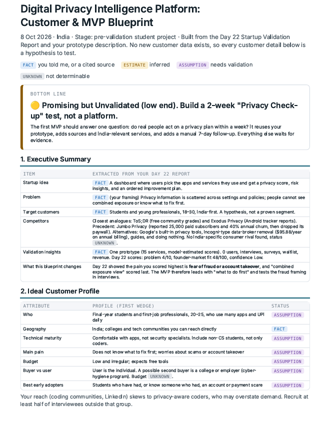
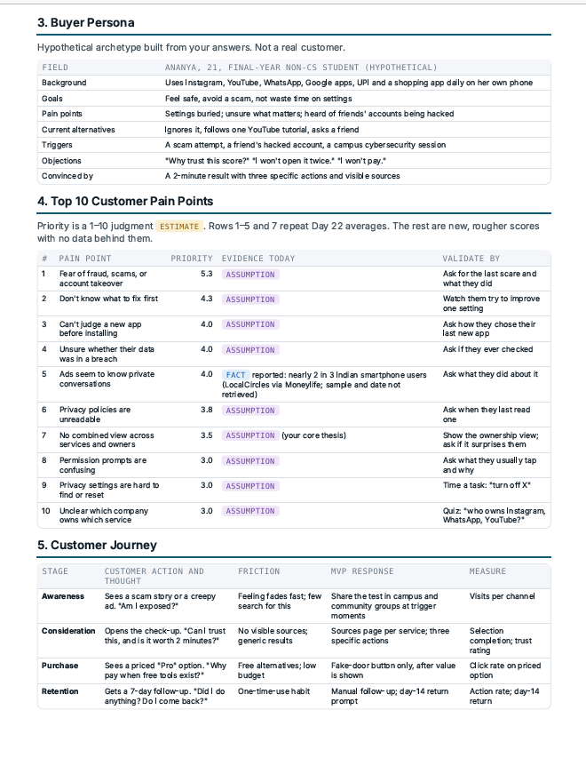
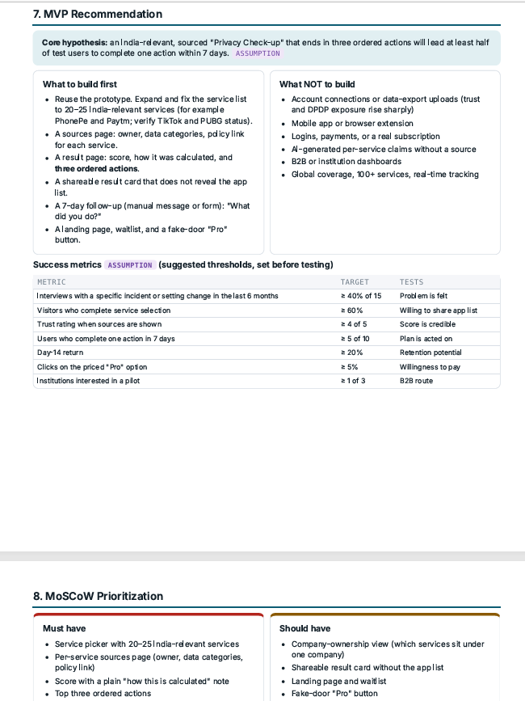

# Day 23 — Customer & MVP Blueprint 🚀

## 🎯 Objective

The goal of Day 23 was to convert my Day 22 Startup Validation Report into a focused **Customer & MVP Blueprint**.

I used Claude as a **Startup Product Manager and Customer Research Expert** to identify my ideal customer, understand their pain points, prioritize MVP features, analyze risks, and create a focused 30-day execution plan.

---

## 💡 Startup

**Digital Privacy Intelligence Platform**

The idea is to help users understand their digital privacy exposure across the apps and online services they use and provide simple, actionable recommendations.

---

## 📋 Executive Summary

The Day 23 analysis shows that the idea is:

### 🟡 Promising but Unvalidated

The current prototype demonstrates product-building capability, but there is still no measured customer demand.

The recommended approach is to **validate customer behavior before investing heavily in additional features**.

### Current Validation

| Metric              | Status |
| ------------------- | -----: |
| Working Prototype   |      1 |
| External Users      |      0 |
| Customer Interviews |      0 |
| Waitlist            |      0 |
| Revenue             |     ₹0 |

---

## 🎯 Ideal Customer Profile

The recommended initial customer segment is:

* Final-year college students
* First-job professionals
* Age approximately 20–25
* India
* Regular users of multiple digital services
* Comfortable with basic digital/online services
* Potential concern around scams, account security and privacy

The main problem to validate is:

> **“What should I fix first to reduce my digital risk?”**

This segment is still a **hypothesis** and requires real customer conversations.

---

## 👤 Buyer Persona

The buyer persona represents a hypothetical early adopter from the initial target segment.

The persona focuses on:

* Digital habits
* Privacy/security concerns
* Goals
* Current alternatives
* Buying triggers
* Objections
* Budget sensitivity

This persona is **not based on an actual interviewed customer yet**.

---

## 🔥 Top Customer Pain Points

The analysis identified several potential customer pain points.

The strongest area to investigate is:

**Fear of fraud or account takeover.**

Other areas include:

* Not knowing what privacy/security issue to fix first
* Difficulty judging whether a new app is trustworthy
* Unclear privacy implications of multiple services
* Complexity of privacy policies and settings

An important learning was that the original **combined-exposure dashboard idea may not be the strongest pain point**.

Customer interviews should therefore test the fraud/security angle instead of assuming the original hypothesis is correct.

---

## 🛣️ Customer Journey

The customer journey was mapped across:

**Awareness → Consideration → Purchase → Retention**

At each stage, the goal is to understand:

* What triggers the customer?
* What information do they need?
* What prevents them from taking action?
* What would make them trust the product?
* What would make them return?

---

## 🚀 MVP Recommendation

### What should be built first?

Claude recommended a small **Privacy Check-up** MVP.

Initial scope:

* 20–25 India-relevant services
* Sources page for service information
* Simple privacy/risk result
* Three prioritized actions
* Manual 7-day follow-up
* Measure whether users actually take action

### What should NOT be built now?

Avoid:

* Connected accounts
* Personal data exports
* Mobile app
* Browser extension
* Complex login/payment systems
* Unsourced AI-generated privacy claims

The focus should be **learning, not feature expansion**.

---

## 🧩 MoSCoW Prioritization

### Must Have

* Service selection
* Privacy/risk assessment
* Sources for claims
* Three prioritized actions
* Basic feedback mechanism

### Should Have

* More India-specific services
* Better visualizations
* 7-day follow-up

### Could Have

* Personal accounts
* Advanced analytics
* Additional integrations

### Won't Have — For Now

* Connected account scanning
* Mobile application
* Browser extension
* Large-scale automated data collection

---

## 💰 Pricing Hypothesis

Potential future models include:

* Freemium
* Individual premium subscription
* Institutional/college pilot

Illustrative pricing such as **₹99/month or ₹499/year** should be treated only as a **pricing experiment**, not proven willingness to pay.

The institutional pricing opportunity remains unknown and needs validation.

---

## ⚠️ Top 5 Risks

| Risk             | Concern                                      |
| ---------------- | -------------------------------------------- |
| Customer Demand  | Users may not care enough to act             |
| Problem Severity | Privacy may not feel urgent                  |
| Trust            | Users may not trust the scores               |
| Accuracy         | Privacy estimates may be incorrect           |
| Distribution     | Reaching users consistently may be difficult |

The biggest risk is whether users **take action** after receiving the privacy recommendations.

---

## 📅 30-Day MVP Plan

### Week 1 — Customer Discovery

* Conduct customer interviews
* Focus on real past privacy/security incidents
* Test the fraud/account-takeover hypothesis

### Week 2 — MVP Experiment

* Build the small Privacy Check-up
* Add India-relevant services
* Add sources and evidence

### Week 3 — User Testing

* Test with real users
* Track completion and actions
* Collect feedback

### Week 4 — Measurement

* Analyze results
* Measure trust and engagement
* Decide whether to Build, Pivot or Pause

---

## 📝 Founder Action Sheet

Top actions:

1. Talk to the first 5 potential users.
2. Ask about their most recent privacy/security concern.
3. Avoid asking only whether they like the dashboard idea.
4. Test whether the concern caused real action.
5. Validate the fraud/account-takeover hypothesis.
6. Test the Privacy Check-up MVP.
7. Add evidence/sources for privacy claims.
8. Measure user actions after the assessment.
9. Test wil

