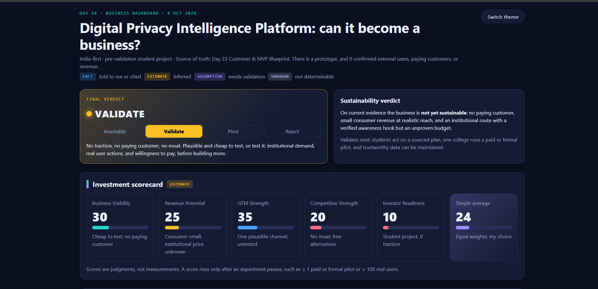
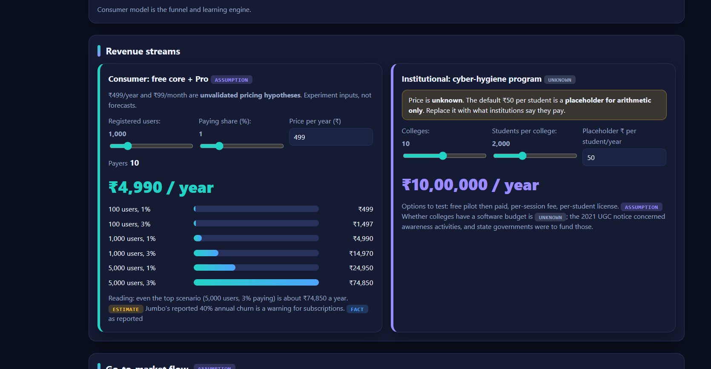
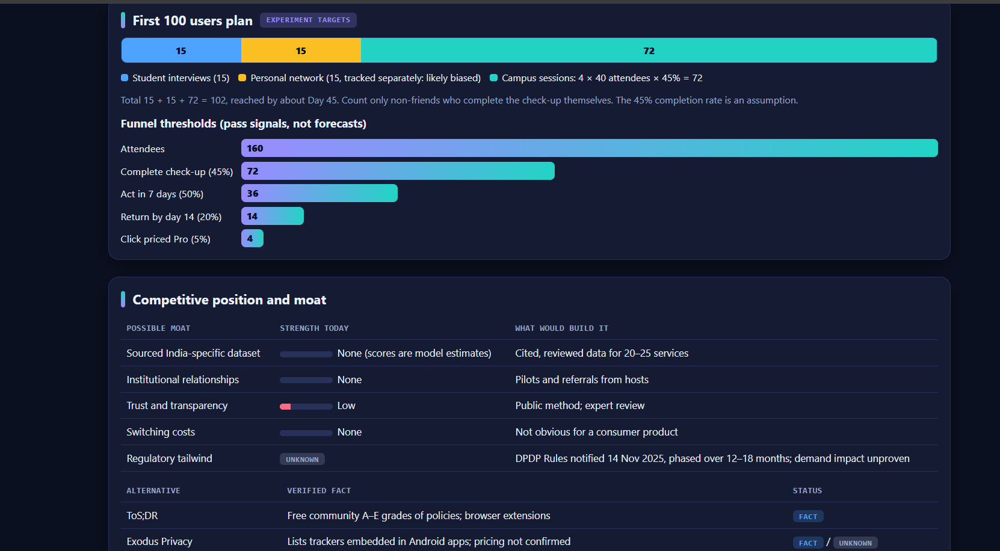

# Day 24 — Business Strategy & Sustainability Analysis

## 🎯 Objective

Evaluate whether my Digital Privacy Intelligence Platform can become a sustainable business using Claude as an AI Co-Founder and Business Strategy Advisor.

## 💡 Startup Overview

The platform aims to help Indian users understand their digital privacy exposure, identify important risks, and take practical actions through a simple Privacy Check-up.

## 📊 Business Strategy

* **Business verdict:** VALIDATE
* **Initial customer segment:** Final-year undergraduate students in India, including non-CS students.
* **Primary distribution channel:** Campus cyber-awareness sessions with college cyber clubs or IT cells.
* **Consumer revenue hypothesis:** ₹499/year or ₹99/month — not validated.
* **Institutional model:** Cyber-hygiene sessions or college pilots — pricing unknown.
* **Current traction:** 0 confirmed external users, 0 paying customers, and ₹0 revenue.

## 🔍 Key Learnings

1. A working prototype does not prove market demand.
2. Customer acquisition and distribution matter as much as product features.
3. Consumer subscriptions may generate limited revenue at small scale.
4. Institutional demand and willingness to pay must be tested directly.
5. Trustworthy, sourced privacy information is essential.
6. Revenue projections and scorecards are estimates, not measured results.

## 📈 Investment Scorecard

| Dimension            |  Score |
| -------------------- | -----: |
| Business Viability   | 30/100 |
| Revenue Potential    | 25/100 |
| GTM Strength         | 35/100 |
| Competitive Strength | 20/100 |
| Investor Readiness   | 10/100 |

**Simple average:** 24/100. These are judgment-based assessments, not objective measurements.

## 🗓️ 30-Day Validation Priorities

* Interview students and institutional contacts.
* Test a sourced Privacy Check-up with real users.
* Measure whether users take action after seven days.
* Test willingness to pay without assuming conversion.
* Seek at least one formal or paid institutional pilot.
* Decide whether to continue, pivot, or pause based on evidence.

## 📸 Screenshots

### 1. Business Overview

### 2. Revenue & Go-To-Market

### 3. First 100 Users & Competition

## 📁 Project Files

* `day24-business-strategy-report.pdf`
* `day24-business-strategy-report.md`
* `day24-business-dashboard.html`

## ✅ Final Verdict

**VALIDATE — Promising but Unvalidated.**

The next priority is to prove that users take action, colleges show real willingness to run a pilot, and the privacy information can be maintained reliably.

**ABTalks 60 Days Claude Challenge — Day 24/60**

