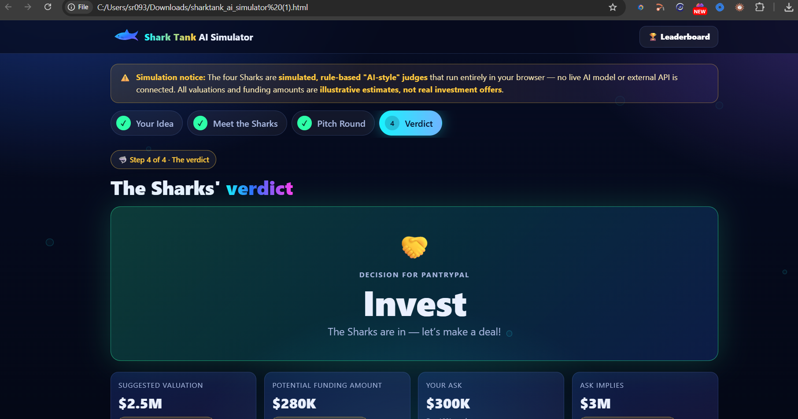

# Day 25 — AI Shark Tank Simulator 🦈

## 📌 Overview
For Day 25 of the ABTalks 60 Days Claude Challenge, I built an interactive **AI Shark Tank Simulator** using Claude.

The application allows users to pitch their startup ideas, answer questions from virtual judges, and receive a structured evaluation with a final investment verdict.

## ✨ Features
- Startup pitch form covering the problem, solution, revenue model, target audience, and funding ask.
- Four virtual judges: Venture Capitalist, Founder, Customer, and Angel Investor.
- Eight questions to evaluate the startup pitch.
- Scorecard for Market Potential, Innovation, Business Model, Execution, and Investment Worthiness.
- Investment verdict: Invest, Reject, Acquire, or Come Back Later.
- Illustrative valuation and funding assessment.
- Leaderboard and downloadable pitch report feature.
- Dark, Shark Tank-inspired interface.

## 🛠️ Technologies
- HTML
- CSS
- JavaScript
- Claude for application generation

## 📂 Project Files
- `sharktank_ai_simulator.html` — Standalone HTML application.
- `day25_verdict.png` — Screenshot of the final simulation verdict.

## 📸 Final Verdict Screenshot

## 🧠 Key Learnings
- Turning a detailed prompt into an interactive web application.
- Designing a multi-step user experience.
- Using scoring criteria to evaluate startup ideas.
- Presenting feedback and investment decisions in a structured interface.
- Testing and documenting the final output.

## ⚠️
