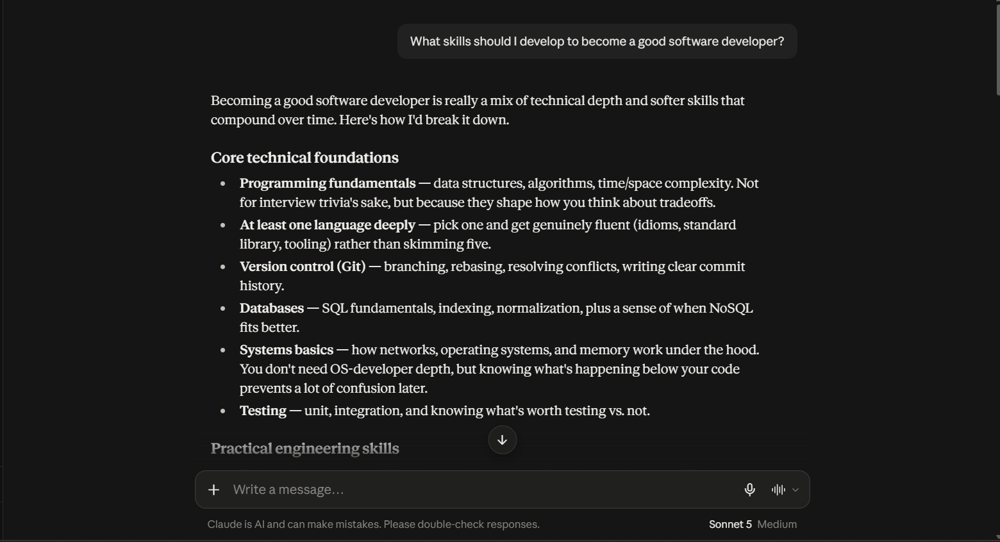
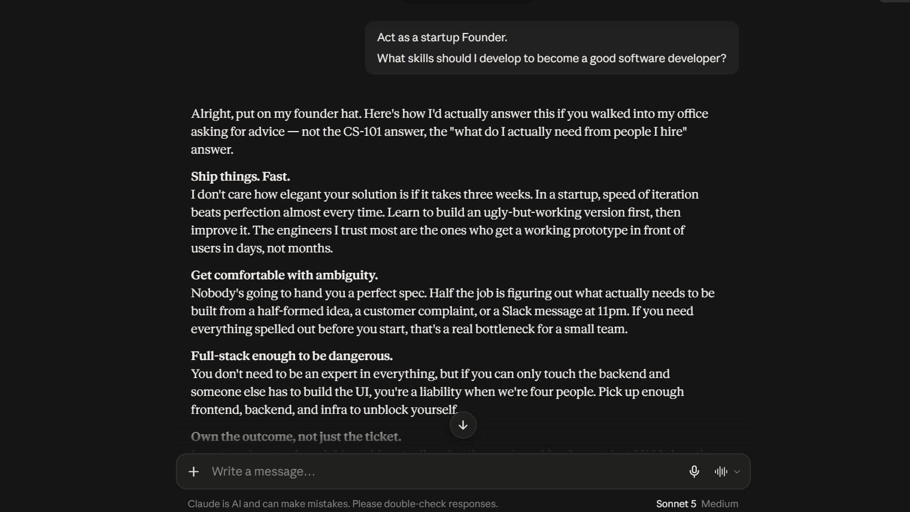
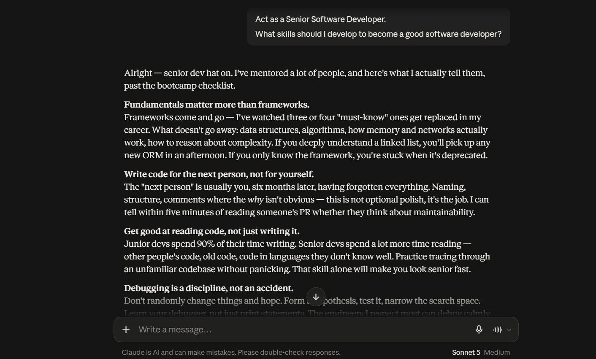
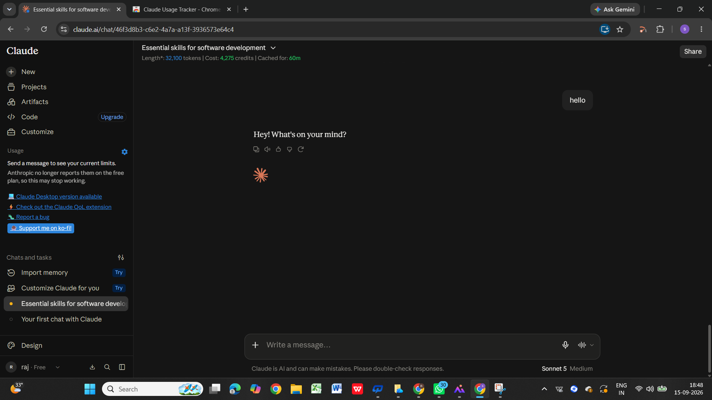

# Day 3 – Role-Based Prompting

## What I Worked On

Today I explored Role-Based Prompting in Claude by asking the same question in three different ways:

1. Without assigning any role
2. Using a Founder persona
3. Using a Senior Software Developer persona

I also installed and explored the Claude Usage Counter extension.

---

## 1. Without Role

### Prompt

> What skills should I develop to become a good software developer?

### Output Summary

Claude provided a broad and balanced overview of the skills required to become a good software developer.

It focused on:
- Programming fundamentals
- Data Structures and Algorithms
- Git and version control
- Databases
- Debugging
- Testing
- System design
- Reading and writing code
- Communication
- Continuous learning

The response was general and covered both technical and soft skills.

### Screenshot

---

## 2. Founder Persona

### Prompt

> Act as a startup Founder.
>
> What skills should I develop to become a good software developer?

### Output Summary

With the Founder persona, Claude changed its perspective toward startup environments and hiring.

It emphasized:
- Shipping products quickly
- Handling ambiguity
- Full-stack knowledge
- Ownership and accountability
- Customer focus
- Resourcefulness
- Communication
- Business impact
- Practical judgment

The response focused more on what a Founder would value in a software developer.

### Screenshot

---

## 3. Developer Persona

### Prompt

> Act as a Senior Software Developer.
>
> What skills should I develop to become a good software developer?

### Output Summary

With the Senior Software Developer persona, Claude focused more deeply on engineering practices.

It emphasized:
- Strong programming fundamentals
- Writing maintainable code
- Reading existing code
- Systematic debugging
- Understanding requirements
- Testing
- Code reviews
- Technical depth
- T-shaped skills

The response felt more like advice from an experienced developer or mentor.

### Screenshot

---

## Comparison

| Aspect | Without Role | Founder | Senior Developer |
|---|---|---|---|
| Perspective | General | Startup / Business | Technical / Engineering |
| Main Focus | Broad skill roadmap | Ownership and impact | Engineering excellence |
| Technical Depth | Balanced | Moderate | High |
| Business Focus | Low | High | Low |
| Customer Focus | Low | High | Moderate |
| Engineering Practices | General | Practical | Strong |
| Tone | General Advisor | Founder / Mentor | Senior Developer / Mentor |

---

## Key Learnings

- Assigning a role changes the perspective of Claude's response.
- The same question can produce noticeably different answers when the persona changes.
- A Founder persona emphasizes speed, ownership, customer impact, and business judgment.
- A Developer persona emphasizes technical fundamentals, debugging, maintainability, testing, and code quality.
- Without a role, Claude provides a more general and balanced response.
- Role-Based Prompting helps make AI responses more targeted and relevant to a specific perspective.

---

## Claude Usage Counter

I installed the Claude Usage Counter extension and explored its interface.

The extension displayed a message indicating that current usage limits are no longer reported by Anthropic on the Free plan, so the usage statistics may not be available.

This helped me understand that browser extensions may depend on information provided by the platform.

### Screenshot

---

## Conclusion

This experiment showed me that Role-Based Prompting is a simple but powerful way to guide an AI toward a specific perspective.

The question remained the same, but changing the role from no role to Founder and Senior Developer resulted in different priorities, tone, and recommendations.

Role-Based Prompting can therefore make AI responses more focused, contextual, and useful.

---

## Challenge Completed

- [x] Read about Role-Based Prompting
- [x] Asked Claude without a role
- [x] Saved the output
- [x] Asked the same question with a Founder persona
- [x] Asked the same question with a Developer persona
- [x] Compared the responses
- [x] Installed and explored Claude Usage Counter
- [x] Created Day3 folder
- [x] Created day3.md
- [x] Added screenshots and learnings
