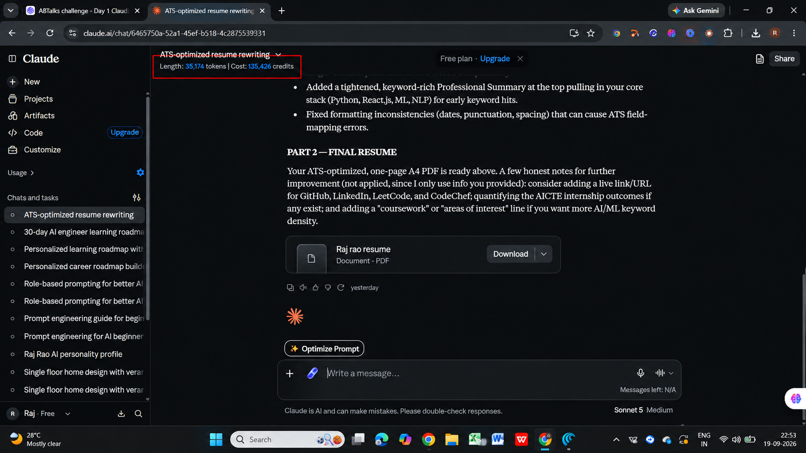
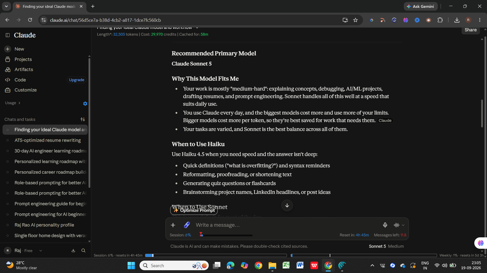
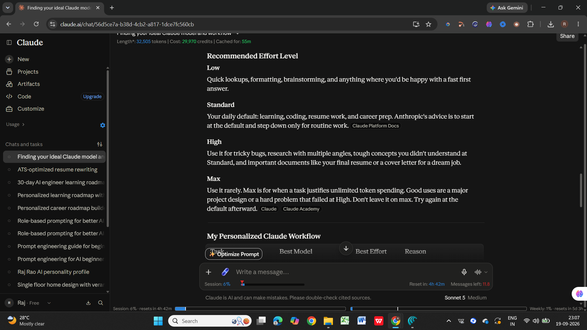
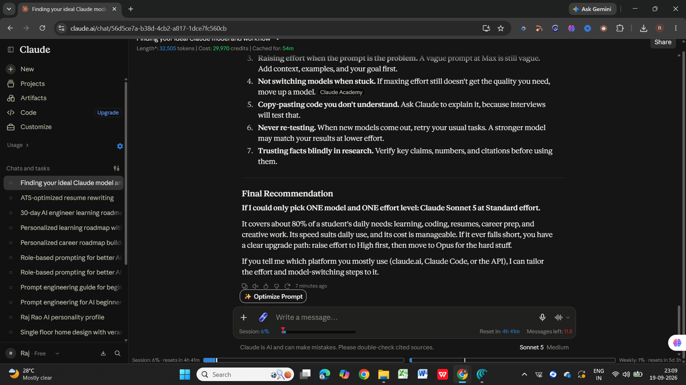

# Day 7 – Claude Usage Strategy

## 🎯 Objective

The goal of Day 7 was to understand how to choose the appropriate
Claude model and effort level based on different tasks and workflows.

## 👤 My Profile

- Current Situation: Student
- Primary Activities: Coding, Learning, Research, Resume Building,
  Career Preparation, AI/ML Projects, Prompt Engineering
- Claude Usage: Daily
- Main Outputs: Learning Support, Coding Help, Fast Answers,
  Deep Research, Career Preparation and Creative Work

## 🧩 Claude Counter

I installed the Claude Counter browser extension to monitor Claude
usage information directly within the Claude interface.

The extension displayed token and usage information inside Claude.

## 🤖 My Claude Usage Strategy

### Recommended Primary Model

**Claude Sonnet 5**

### Why This Model Fits Me

Claude recommended Sonnet as the primary model because my daily work
includes learning, coding, AI/ML projects, resume building, research,
prompt engineering, and career preparation.

It provides a balance between response quality and speed for regular
daily tasks.

## ⚡ When to Use Different Models

### Haiku

Use for:
- Quick definitions
- Syntax reminders
- Proofreading
- Reformatting
- Brainstorming
- Flashcards and quizzes

### Sonnet

Use as the default model for:
- Learning new concepts
- Coding and debugging
- AI/ML projects
- Prompt engineering
- Resume writing
- Career preparation
- Research summaries

### Opus

Use for more complex tasks such as:
- Complex project architecture
- Difficult debugging
- Deep research and synthesis
- Important portfolio projects

## 🎚️ Recommended Effort Levels

### Low

Quick lookups, formatting, brainstorming, and simple tasks.

### Standard

My default level for learning, coding, resume work, and career
preparation.

### High

Use for difficult bugs, deeper research, challenging concepts,
and important documents.

### Max

Use rarely for highly complex problems that require maximum reasoning.

## 🔄 Personalized Claude Workflow

| Task | Best Model | Best Effort |
|---|---|---|
| Quick doubt or definition | Haiku | Low |
| Learning a new concept | Sonnet | Standard |
| Daily coding help | Sonnet | Standard |
| Stubborn bug | Opus | High |
| AI/ML project planning | Sonnet → Opus | Standard → High |
| Prompt engineering | Sonnet | Standard |
| Quick research | Sonnet | Standard |
| Deep research | Opus | High |
| Resume drafting | Sonnet | Standard |
| Resume final polish | Sonnet/Opus | High |
| Mock interviews | Sonnet | Standard |
| Career roadmap | Sonnet | High |
| Creative work | Haiku → Sonnet | Low → Standard |
| Proofreading | Haiku | Low |

## 🚫 Biggest Mistakes to Avoid

- Using Opus or Max for every task.
- Leaving Max effort enabled unnecessarily.
- Increasing effort instead of improving a vague prompt.
- Not switching models when a task remains difficult.
- Copying code without understanding it.
- Failing to verify important research claims.
- Not adapting model and effort settings to task complexity.

## 💡 Key Learnings

- Different tasks require different levels of reasoning.
- Simple tasks do not always require the highest effort.
- Model selection should depend on task complexity.
- Context and clear prompting remain important even with powerful models.
- A structured AI workflow can improve productivity.
- Using the appropriate model and effort can balance speed and quality.

## 🎯 Final Recommendation

Based on the generated strategy, the recommended default is:

**Primary Model:** Claude Sonnet 5  
**Default Effort:** Standard

For simple tasks, use Haiku with Low effort. For difficult tasks,
increase effort or move to a more capable model when necessary.

## 🛠️ Tools Used

- Claude
- Claude Counter Browser Extension

## 📅 Challenge

**ABTalks – 60 Days Claude Challenge**

**Day 7/60 – Claude Usage Strategy**
