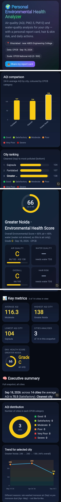

# Day 8 – Personal Environmental Health Analyzer

## 🎯 Objective

The goal of Day 8 was to explore Claude Artifacts by building an interactive environmental health dashboard from a detailed natural-language prompt.

## 🌍 Project

### Personal Environmental Health Analyzer

The dashboard analyzes environmental conditions using AQI, PM2.5, and PM10 data and presents the information through an interactive visual interface.

## 📊 Dashboard Features

- Average AQI
- Highest AQI city
- Lowest AQI city
- Number of cities analyzed
- Environmental Health Score
- AQI comparison chart
- City ranking chart
- AQI distribution chart
- Selected-city AQI trend
- Interactive filters
- City comparison
- Environmental health report card
- Executive summary
- Environmental insights and recommendations
- Responsive dark-theme dashboard

## 📍 Dashboard Data

The generated dashboard included city-level AQI information for locations including:

- Greater Noida
- Faridabad
- Gajraula

The dashboard also displayed AQI categories based on the CPCB scale.

## 📸 Dashboard Screenshots

## 🔎 Key Observations

For the displayed filtered snapshot:

- Average AQI: **116.3**
- Highest AQI: **138 – Greater Noida**
- Lowest AQI: **104 – Gajraula**
- Cities in the selected view: **3**
- Greater Noida Environmental Health Score: **66/100 – Grade C**

The dashboard also visualized an AQI trend for Greater Noida.

## 💧 Data Limitation

Verified city-level water-quality data was not available in the retrieved dataset. Instead of inventing values, the dashboard clearly indicated that water-quality information was unavailable.

## 💡 Key Learnings

- Claude Artifacts can transform natural-language requirements into interactive applications.
- Detailed prompts can specify dashboard structure, charts, filters, and user experience.
- Data visualization makes environmental information easier to understand.
- Interactive filters allow users to explore different subsets of data.
- Data limitations should be clearly communicated instead of filling missing values with assumptions.
- AI can assist in building complete frontend dashboard prototypes from a single detailed prompt.

## 🛠️ Tools Used

- Claude
- Claude Artifacts
- Web-based environmental data
- HTML
- Interactive charts and dashboard components

## 📅 Challenge

**ABTalks – 60 Days Claude Challenge**

**Day 8/60 – Claude Artifacts: Personal Environmental Health Analyzer**
