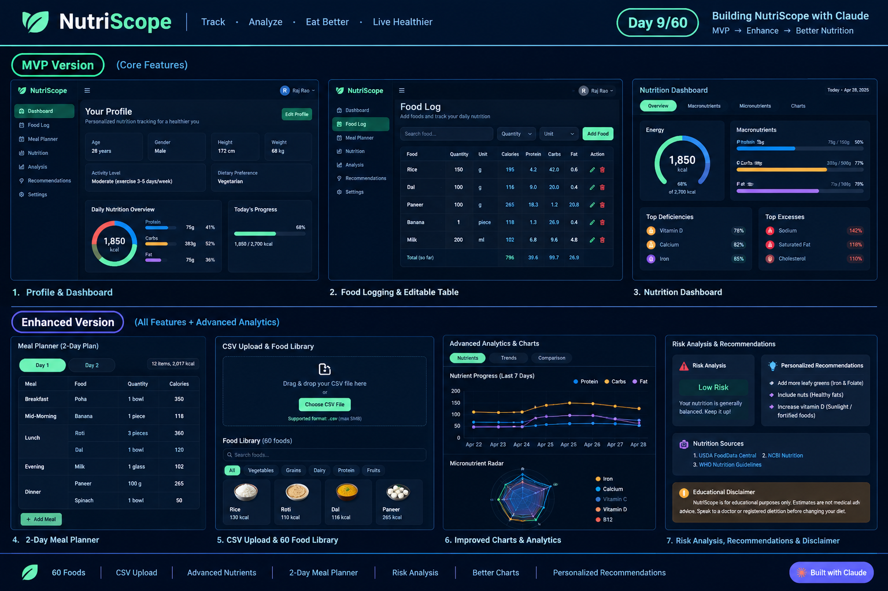

# Day 9 – NutriScope: Iterative AI Product Building

## 🎯 Objective

The goal of Day 9 was to understand how AI applications can be built using an iterative development approach.

Instead of asking AI to create a very large application in one step, the process focused on:

1. Building a working MVP first
2. Generating a functional HTML application
3. Enhancing the MVP with a second focused prompt
4. Comparing the initial and enhanced versions
5. Documenting the development process

---

## 💡 What I Learned

One of the biggest mistakes beginners make is asking AI to build extremely large applications in a single prompt.

Professional AI builders use iterative development:

- **MVP First:** Generate a working version before adding complexity.
- **Iterative Development:** Improve outputs through multiple focused prompts.
- **Claude Artifacts:** Generate real interactive applications.
- **AI Product Building:** Build products the same way experienced builders do.

This approach helps improve reliability, quality, and output consistency.

---

# 🥗 Project: NutriScope

NutriScope is a browser-based nutrition tracking application designed to help users:

- Create a nutrition profile
- Track food intake
- Monitor calories and macronutrients
- Track micronutrients
- Plan meals
- Analyze nutrient deficiencies and excesses
- Get personalized nutrition recommendations

The application was created as a single-file HTML application without a backend.

---

# 🚀 MVP Version

The first version focused on the core functionality required for a nutrition tracking application.

### MVP Features

- Profile inputs
  - Age
  - Gender
  - Height
  - Weight
  - Activity Level
  - Dietary Preference

- Food logging
  - Add food
  - Quantity
  - Unit
  - Editable food entries
  - Remove food entries

- Food database containing common foods

- Nutrition tracking:
  - Calories
  - Protein
  - Carbohydrates
  - Fat
  - Fiber
  - Iron
  - Calcium
  - Vitamin C
  - Vitamin D
  - Vitamin B12

- Energy and macro targets

- Micronutrient targets

- Percentage completion

- Nutrition dashboard

- Charts using Chart.js

- Food recommendations

- Premium dark SaaS-style interface

- Mobile responsive design

- Single HTML file with no backend

---

# ⚡ Enhanced Version

After creating the MVP, a second focused prompt was used to enhance the application.

### Enhancements Added

- CSV food diary upload
- Downloadable CSV template
- Expanded food library with 60 foods
- Additional micronutrients
- 2-day meal planner
- Risk analysis
- Educational disclaimer
- Nutrition sources
- Improved charts
- Advanced recommendations
- More detailed nutrition analysis

The enhanced version also retained the core MVP functionality.

---

# 🔄 MVP vs Enhanced Version

| Feature | MVP | Enhanced |
|---|---|---|
| Profile inputs | ✅ | ✅ |
| Food logging | ✅ | ✅ |
| Food database | 20 common foods | 60 foods |
| Calories | ✅ | ✅ |
| Macronutrients | ✅ | ✅ |
| Micronutrients | Basic | Expanded |
| Charts | Basic | Improved |
| CSV Upload | ❌ | ✅ |
| Meal Planner | Basic food logging | 2-day planner |
| Risk Analysis | ❌ | ✅ |
| Recommendations | Basic | Advanced |
| Nutrition Sources | ❌ | ✅ |
| Educational Disclaimer | ❌ | ✅ |

---

# 🧠 Key Learning

The main lesson from Day 9 was that effective AI product development does not require generating the entire complex application in one prompt.

A better workflow is:

**Idea → MVP → Test → Identify improvements → Enhance → Compare → Iterate**

This makes it easier to control the output and progressively add functionality.

---

# 🛠️ Tools Used

- Claude
- Claude Artifacts
- HTML
- CSS
- JavaScript
- Chart.js
- GitHub

---

# 📸 Screenshots

### Enhanced NutriScope

The enhanced application includes the updated dashboard, meal planner, CSV import functionality, and expanded nutrition features.

---

# 📁 Project Files

- `nutriscope-mvp.html` – MVP version
- `nutriscope-enhanced.html` – Enhanced version
- `day9-enhanced.png` – Enhanced application screenshot
- `day9-mvp.png` – MVP application screenshot
- `day9.md` – Day 9 documentation

---

# 💭 Reflection

Day 9 helped me understand that AI can be used not only for generating text or code snippets, but also for building and progressively improving interactive applications.

The most important takeaway was:

> Build small → test → improve → iterate.

This iterative approach makes AI-assisted product development more structured and manageable.
